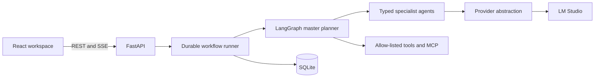

# AI Data Modelling Assistant MVP

A local-first, chat-driven assistant for turning source metadata and modelling scenarios into reviewable dimensional-model assets. It combines a React workspace, FastAPI, durable LangGraph orchestration, SQLite persistence, and local LM Studio models.

## What works

- Create, reopen, search, duplicate, and delete modelling projects.
- Upload and profile CSV, JSON, DDL/SQL, XLSX, and XLSM sources.
- Run a master planner with typed requirement, source-analysis, model-design, mapping/DQ, and validation specialists.
- Stream progress and responses over reconnectable SSE.
- Generate versioned source previews, logical models, mappings, DQ rules, and validation assets.
- Review, revise, regenerate, and browse artifact history.
- Use allow-listed local tools and approval-gated MCP tools.
- Resume durable runs and prevent duplicate requests, tool operations, messages, and artifact versions.
- Use deterministic fast paths for clear source metadata and structural validation, with LLM escalation when semantics are ambiguous.
- Call `nomic-embed-text` through an embedding-provider interface. Retrieval is intentionally deferred.

The logical-model canvas remains closed and empty until a generated asset is selected.

## Stack

| Layer | Technology |
| --- | --- |
| Frontend | React 18, strict TypeScript, Vite, TanStack Query |
| API | Python 3.12, FastAPI, Pydantic |
| Agents | LangGraph, typed specialists, bounded reactive planning |
| Persistence | SQLite, SQLAlchemy, Alembic |
| Local AI | LM Studio OpenAI-compatible chat and embedding APIs |
| Quality | Pytest, Ruff, mypy, Vitest, ESLint, TypeScript |

## Prerequisites

- Python 3.12 or newer
- [uv](https://docs.astral.sh/uv/getting-started/installation/)
- Node.js 20.19 or newer (or 22.12 or newer) with npm
- LM Studio with its local API server enabled

Load these models in LM Studio:

- Chat: `gemma-4-12b-qat`
- Embeddings: `nomic-embed-text`
- Base URL: `http://localhost:1234/v1`

The interface and project CRUD run without LM Studio. Model generation and provider health checks require the chat model to be loaded.

## Quick start

From the repository root:

```bash
make setup
make dev
```

`make setup` creates `.env` when needed, installs locked dependencies, and applies every database migration. `make dev` starts both services with live reload. Press `Ctrl+C` to stop them.

Open:

- App: [http://127.0.0.1:5173](http://127.0.0.1:5173)
- API docs: [http://127.0.0.1:8000/docs](http://127.0.0.1:8000/docs)
- Readiness: [http://127.0.0.1:8000/api/ready](http://127.0.0.1:8000/api/ready)

### Background hosting

```bash
make start
make status
make stop
```

Logs and PID files are stored in the ignored `.run/` directory. `make start` applies pending migrations before launching.

### Separate terminals

```bash
make backend
```

In a second terminal:

```bash
make frontend
```

## Modeller walkthrough

Create the bundled showcase project:

```bash
make seed-example
```

Open **SAP Sales Order Analytics — Example** from Projects. It includes a representative conversation, source assessment, logical model, mappings, DQ rules, and validation findings.

To test a new project:

1. Enter this scenario on Home:

   > Build a sales-order analytics model at one row per order line. The source contains order headers, order lines, customers, products, and order dates. I need net sales, quantity, discount, order count, customer, product, territory, and monthly trend analysis. Generate a logical dimensional model, source-to-target mappings, and core data-quality rules.

2. Create the project and optionally upload matching CSV, JSON, DDL, or spreadsheet metadata.
3. Answer any blocking grain or source questions.
4. Follow the streamed plan and specialist progress.
5. Select the generated **Logical model** asset to open the canvas.
6. Inspect relationships and keys, then review mappings and DQ rules.
7. Approve, request changes, or regenerate only the affected asset.
8. Return to Projects and reopen the project to verify persistence.

Clear profiled metadata is classified locally. Unknown source roles, low-confidence mappings, and explicit review decisions are sent to the configured chat model.

## Configuration

Configuration lives in the ignored root `.env`. Safe defaults are documented in [`.env.example`](./.env.example).

| Variable | Default | Purpose |
| --- | --- | --- |
| `DATABASE_URL` | `sqlite:///./data/assistant.db` | Database relative to `backend/` |
| `APP_HOST` / `APP_PORT` | `127.0.0.1` / `8000` | Backend bind address |
| `FRONTEND_HOST` / `FRONTEND_PORT` | `127.0.0.1` / `5173` | Frontend bind address |
| `VITE_API_URL` | `http://127.0.0.1:8000/api` | Browser-visible API URL |
| `LM_STUDIO_BASE_URL` | `http://localhost:1234/v1` | LM Studio API |
| `LM_STUDIO_MODEL` | `gemma-4-12b-qat` | Chat model |
| `EMBEDDING_MODEL` | `nomic-embed-text` | Embedding model |
| `WORKFLOW_CHECKPOINT_PATH` | `./data/workflow_checkpoints.db` | LangGraph checkpoints |
| `MCP_SERVERS_JSON` | `{}` | Named MCP Streamable HTTP servers |
| `MCP_TOOL_ALLOWLIST` | empty | Fully qualified allowed MCP tools |

Provider settings saved in the Settings screen take precedence for runtime chat requests. API keys remain backend-only and are never returned to the frontend.

### Performance and resilience

- `PLANNER_FAST_PATH` and `PRESENTER_FAST_PATH` remove two LLM calls from standard workflows.
- `DETERMINISTIC_SOURCE_ANALYSIS` handles unambiguous profiled sources locally.
- `DETERMINISTIC_STRUCTURAL_VALIDATION` performs typed referential checks locally.
- `AGENT_RESULT_CACHE_ENABLED` enables provider/model/prompt/input-aware caching.
- `LLM_MAX_CONCURRENCY` bounds simultaneous provider calls.
- Circuit-breaker, timeout, SSE polling, context-size, and cache TTL settings are in `.env.example`.

Set either deterministic option to `false` to force the corresponding specialist through the LLM.

### MCP tools

MCP is disabled until a server and an allow-listed tool are configured:

```dotenv
MCP_SERVERS_JSON={"catalog":"http://127.0.0.1:9000/mcp"}
MCP_TOOL_ALLOWLIST=mcp.catalog.list_tables,mcp.catalog.describe_table
```

MCP plans require modeller approval. Schemas are validated before execution, calls are budgeted, and failed observations can trigger bounded replanning. Configure only trusted servers.

## Trusted LAN hosting

The default binds to localhost. For a trusted LAN, replace `192.168.1.20` with the host address in `.env`:

```dotenv
APP_HOST=0.0.0.0
FRONTEND_HOST=0.0.0.0
FRONTEND_ORIGIN=http://192.168.1.20:5173
VITE_API_URL=http://192.168.1.20:8000/api
```

Then run `make start`. This is a local development deployment without TLS, authentication, or production process supervision. Do not expose it directly to the public internet.

## Database and generated files

```bash
make migrate       # apply Alembic migrations
make seed-example  # create or refresh the showcase project
make clean         # remove caches, logs, PIDs, and frontend build output
```

Application state is stored under ignored `backend/data/`. `make clean` does not delete databases, uploads, `.env`, installed dependencies, or virtual environments. To reset data, first back it up, stop the app, and manually remove `backend/data/`.

Terminal workflow publication is transactional: project state, artifact versions, assistant message, terminal event, status, and lease release become visible together. Progress events remain independently durable for SSE reconnection.

## Tests and checks

```bash
make test
make lint
```

`make test` runs backend and frontend tests. `make lint` runs Ruff, strict mypy, ESLint, TypeScript, and a production frontend build.

Individual commands:

```bash
cd backend
uv run python -m pytest
uv run ruff check .
uv run mypy app

cd ../frontend
npm test -- --run
npm run lint
npm run build
```

## Architecture



The planner produces an authoritative dependency-aware plan with iteration and tool-call budgets. The supervisor validates capabilities, reacts to observations, interrupts for approval, and performs bounded replanning. Agents contain no provider-specific logic.

See [`docs/architecture.md`](./docs/architecture.md) and the product specification [`CODEX_AI_Data_Modelling_Assistant_MVP.md`](./CODEX_AI_Data_Modelling_Assistant_MVP.md).

## Repository layout

```text
backend/
  alembic/             database migrations
  app/api/             thin FastAPI routes
  app/agents/          typed specialists and prompts
  app/autonomy/        planning, skills, tools, and MCP
  app/orchestration/   LangGraph state and master graph
  app/repositories/    persistence boundaries
  app/services/        application workflows
  tests/               backend tests
frontend/
  src/components/      reusable UI components
  src/features/        Home, Projects, Workspace, Settings
  src/services/        typed API and SSE client
scripts/               setup and local process helpers
docs/                   architecture notes
```

## Troubleshooting

### LM Studio health check fails

- Confirm the LM Studio server is running on port `1234`.
- Load `gemma-4-12b-qat` and verify its identifier in Settings.
- Test `http://localhost:1234/v1/models` locally.

### Frontend cannot reach the API

- Check `make status` or the terminal running `make dev`.
- Open `/api/ready` on port `8000`.
- Confirm `VITE_API_URL` and `FRONTEND_ORIGIN` are browser-reachable.
- Restart the frontend after changing `.env`.

### A port is already in use

Run `make stop`, or change `APP_PORT`, `FRONTEND_PORT`, and `VITE_API_URL` consistently.

### Dependencies or migrations are stale

Run `make setup` again. Installation is lockfile-based and safe to repeat.

## Deferred scope

Full retrieval/vector search, live database introspection, legacy `.xls` parsing, production authentication, and production export/deployment infrastructure are outside this MVP slice.
