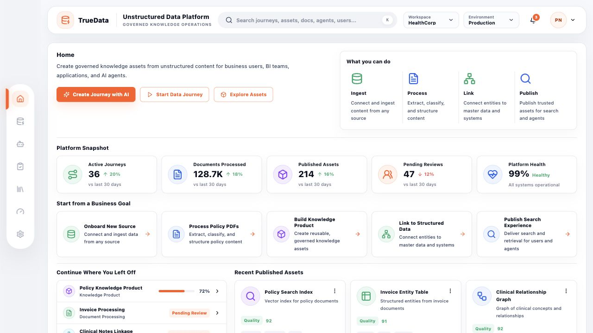
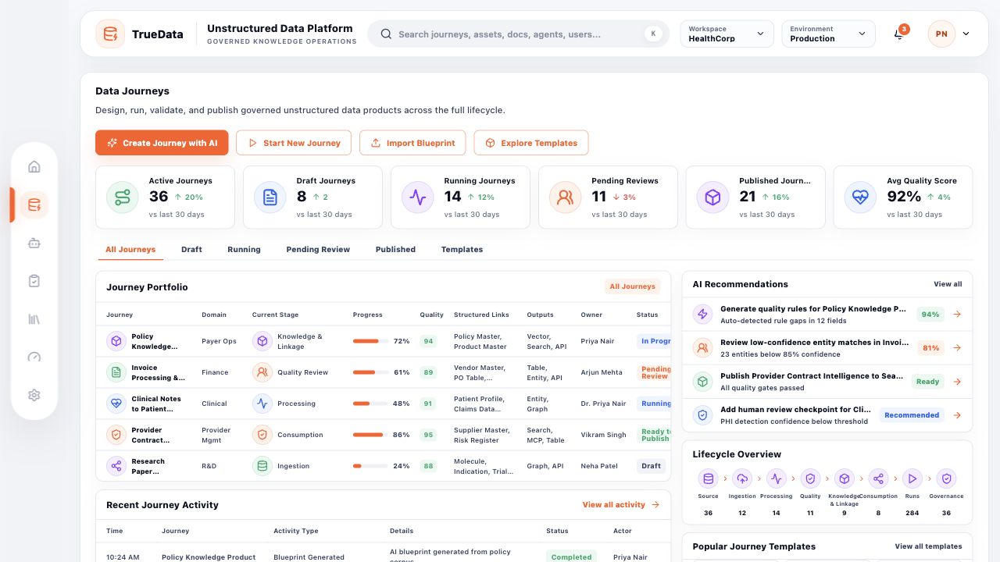
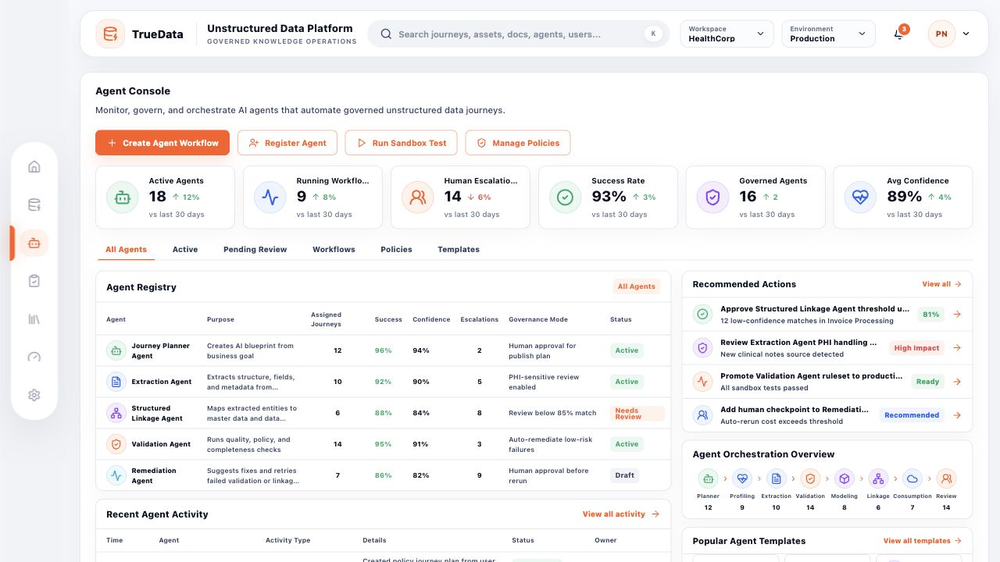
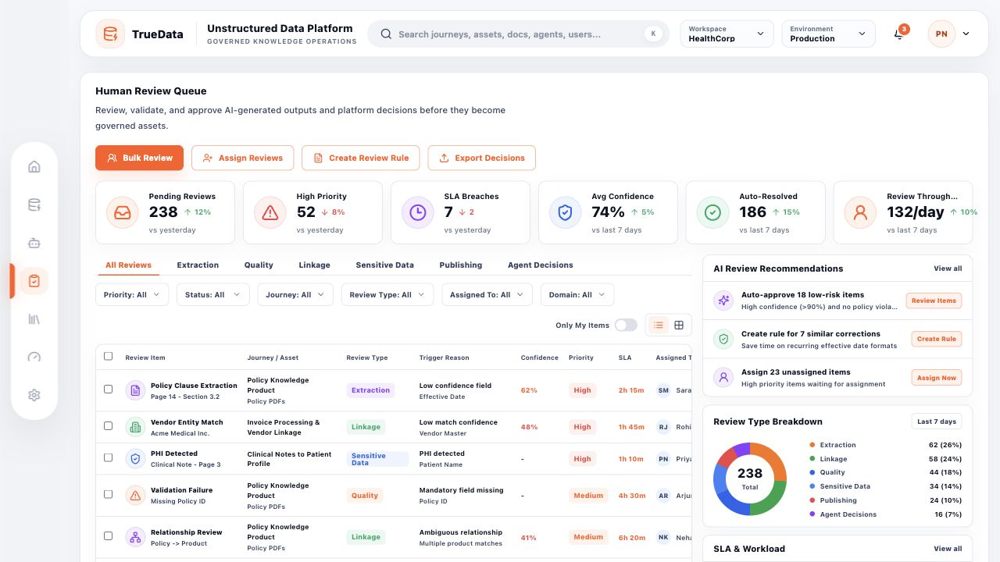
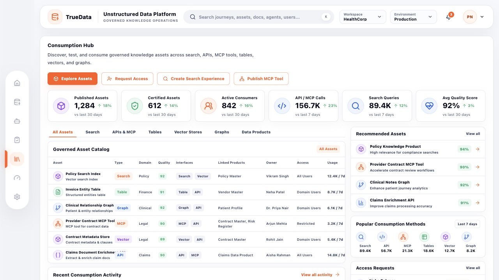
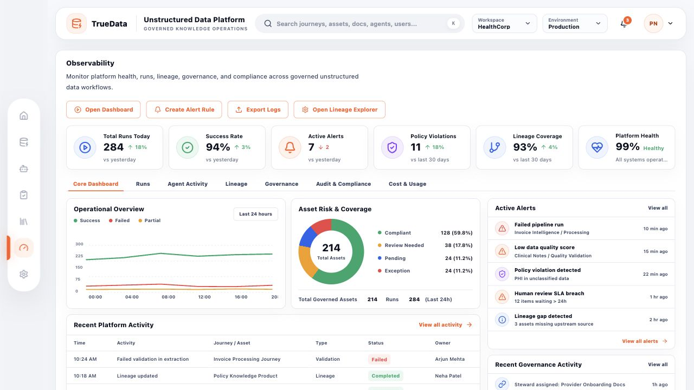

# TrueData: Unstructured Data Platform

TrueData is a high-fidelity React prototype for an enterprise unstructured data platform. It presents a governed operating layer for creating, validating, publishing, consuming, monitoring, and administering trusted knowledge assets from unstructured business content.

The application is built as a clickable dashboard prototype with a floating navigation rail, branded top bar, reusable metric cards, tabular operational views, recommendations, approval queues, service health strips, and domain-specific screens for each major platform workflow.

## Preview



## Features

- **Home dashboard**: Executive snapshot, business-goal launch cards, recently published assets, in-progress journeys, and platform status.
- **Data Journeys**: Journey portfolio, lifecycle overview, AI recommendations, templates, approvals, activity, and connected services.
- **Agent Console**: AI agent registry, orchestration overview, workflow activity, policy actions, and agent service health.
- **Human Review Queue**: Review workload, filters, queue table, AI review recommendations, review breakdown, SLA signals, and review services.
- **Consumption Hub**: Governed asset catalog, consumption methods, access requests, recently published assets, and trust signals.
- **Observability**: Operational health, alerting, run trends, asset risk coverage, governance activity, policy violations, and monitoring services.
- **Admin**: Platform foundation management for connectors, models, policies, access control, environments, approvals, risks, and services.

## Screenshots

### Home


### Data Journeys



### Agent Console



### Human Review Queue



### Consumption Hub



### Observability



### Admin


## Tech Stack

- React 18
- TypeScript
- Vite
- Tailwind CSS
- Lucide React icons

## Getting Started

Install dependencies:

```bash
npm install
```

Start the local dev server:

```bash
npm run dev
```

Build the production bundle:

```bash
npm run build
```

Preview the production build:

```bash
npm run preview
```

## Project Structure

```text
src/
  app/                 App shell routing and screen metadata
  components/
    layout/            Floating sidebar, top bar, shell layout
    ui/                Reusable cards, buttons, pills, metrics, badges
  data/                Static demo data for each platform area
  pages/               Page implementations for each tab
  styles/              Global Tailwind and design tokens
docs/
  screenshots/         README screenshot assets
reference_wireframes/  Original design references used for the prototype
```

## Design Notes

The UI follows an orange, white, and grey enterprise SaaS palette with compact dashboard density. The floating side rail keeps navigation persistent without consuming much horizontal space, while the top bar anchors the product identity as **TrueData | Unstructured Data Platform**.

## Git Notes

Generated build and dependency folders are excluded through `.gitignore`:

- `node_modules/`
- `dist/`
- local caches and TypeScript build info

Before pushing, run:

```bash
npm run build
git status
```
