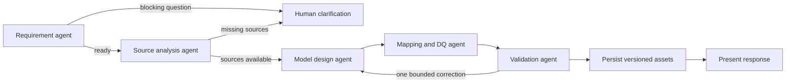

# AI Data Modelling Assistant MVP

The first runnable foundation of a local-first, chat-driven data modelling assistant. It provides a screenshot-aligned React interface, a FastAPI/SQLite API, provider-independent LLM and embedding boundaries, and a LangGraph master orchestrator that coordinates specialist modelling agents.

## What works now

- Create a project from the Home scenario composer.
- Stream agent progress and the final LM Studio response from `gemma-4-12b-qat` over SSE.
- Persist projects and both sides of the conversation in SQLite.
- Persist generated artifacts separately from chat and open viewers only from generated-asset cards.
- Reopen a project from Home or Projects and continue its conversation.
- Search, filter, duplicate, and delete projects.
- Configure and test LM Studio, OpenAI, Anthropic, or a custom provider preset. The Anthropic transport is a deliberate placeholder in this iteration.
- Call `nomic-embed-text` through a minimal embedding service boundary (retrieval is not built yet).
- Run five typed specialists: requirements, source analysis, model design, mappings/DQ, and validation.
- Route deterministically through clarification, generation, bounded rework, persistence, and presentation.
- Generate and version source analysis, logical model, mapping, DQ, and validation assets.
- Fall back to conservative, evidence-labelled DDL analysis if a local structured-model call times out or returns invalid JSON.
- Checkpoint every LangGraph node to a dedicated SQLite database for durable recovery.
- Parse and profile CSV, JSON, DDL/SQL, XLSX, and XLSM source files on the backend.
- Approve assets, request changes, edit JSON as a new version, browse history, and run dependency-aware targeted regeneration.
- Zoom, inspect, select, drag, and persist entity positions on the logical-model canvas.

The logical-model viewer renders persisted structured artifact payloads and remains closed until a modeller selects an available asset. Retrieval, live database introspection, legacy `.xls` parsing, and export generation remain deferred.

## Prerequisites

- Python 3.12 or newer
- [`uv`](https://docs.astral.sh/uv/)
- Node.js 20 or newer and npm
- LM Studio running its local server on `http://localhost:1234`
- In LM Studio, load:
  - chat model: `gemma-4-12b-qat`
  - embedding model: `nomic-embed-text`

## First-time setup

From the repository root:

```bash
cp .env.example .env
make install
```

The defaults already target the supplied LM Studio models. Edit `.env` only if your URL or model identifiers differ.

Apply the database migration:

```bash
make migrate
```

## Launch locally

Start the backend in one terminal:

```bash
make backend
```

Start the frontend in a second terminal:

```bash
make frontend
```

Open [http://localhost:5173](http://localhost:5173). API documentation is available at [http://localhost:8000/docs](http://localhost:8000/docs).

To create or refresh the durable showcase project:

```bash
make seed-example
```

Open **SAP Sales Order Analytics — Example** from Projects. It includes a realistic modelling conversation plus source assessment, logical model, source-to-target mappings, DQ rules, and validation findings. Each viewer opens only when its generated-asset button is selected.

The complete flow is: enter a scenario and attach source files on Home → submit → the backend profiles the files → specialists analyse and generate assets → select an asset card to review or edit it → optionally regenerate that asset → reopen the persisted project from Projects.

## Agent workflow



Every specialist has a versioned prompt and typed Pydantic input/output contract. Agents receive an `LLMProvider`; provider selection and secrets remain outside agent code. `AGENT_REQUEST_TIMEOUT` limits each structured call, after which the safe fallback preserves workflow availability and records the fallback as an assumption.

`WORKFLOW_CHECKPOINT_PATH` controls the node-level LangGraph checkpoint database. A project's latest domain state is also stored with the project, while checkpoints retain execution progress for recovery and audit. Targeted regeneration uses explicit artifact markers internally and skips unchanged upstream agents.

## Verification

```bash
make test
make lint
```

Or run checks independently:

```bash
cd backend
uv run python -m pytest
uv run ruff check .
uv run mypy app

cd ../frontend
npm test -- --run
npm run lint
npm run build
```

## Repository layout

```text
backend/
  alembic/             SQLite migrations
  app/api/             thin FastAPI routes
  app/repositories/    persistence boundaries
  app/services/        application workflows
  app/llm/             provider and embedding abstractions/adapters
  app/agents/          typed specialists and versioned prompts
  app/orchestration/   LangGraph state and master graph
  tests/
frontend/
  src/components/      reusable chat, artefact, and common UI
  src/features/        Home, Projects, Workspace, and Settings routes
  src/services/        typed API and SSE client
  src/types/           shared frontend contracts
docs/
  architecture.md
```

Configuration is environment-driven. API keys are stored only by the backend, are excluded from Git, and are represented to the frontend only as `api_key_configured: true|false` after saving.
