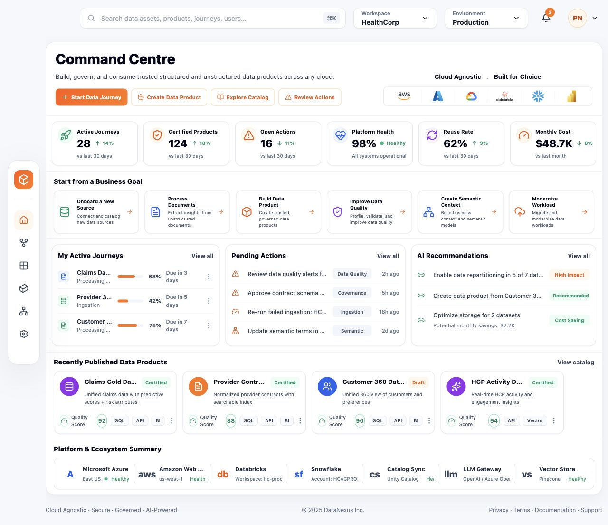
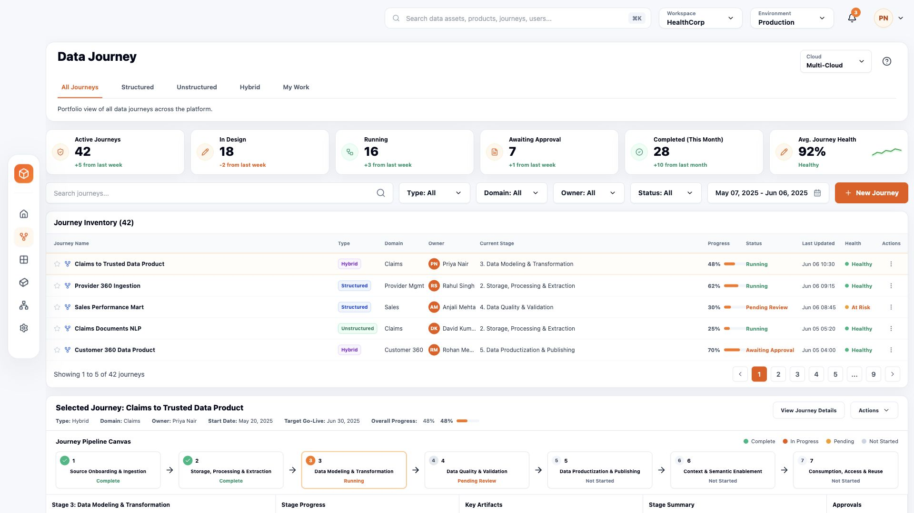
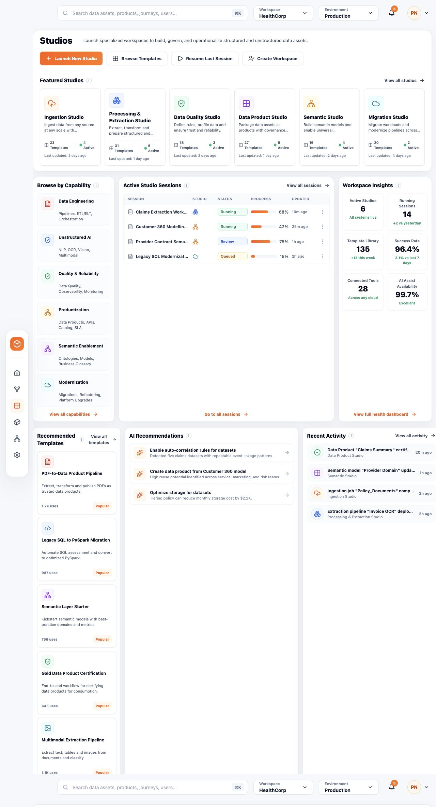
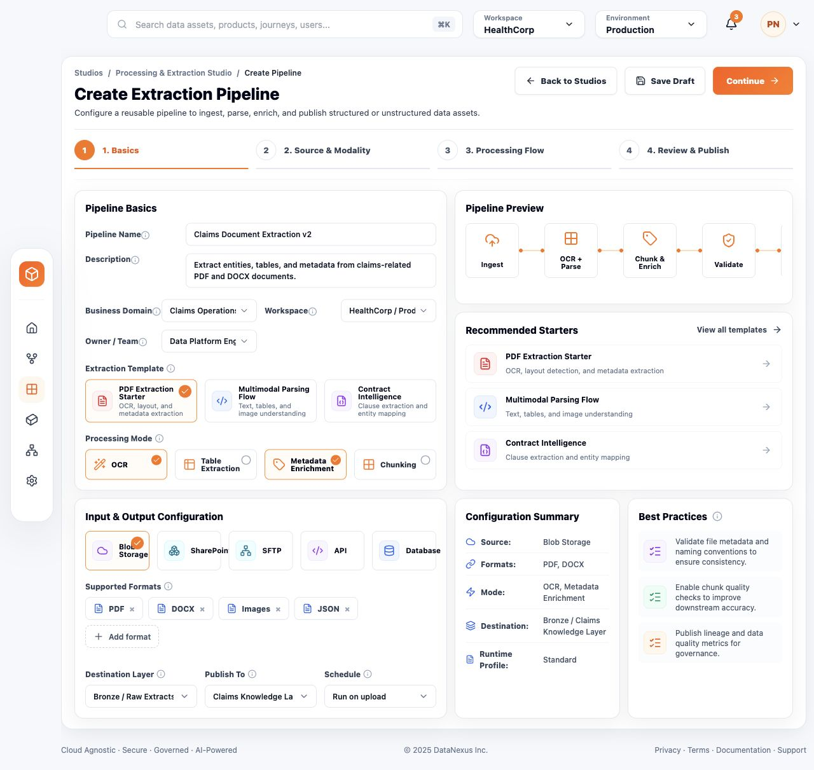
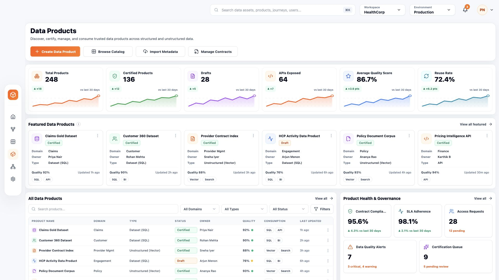
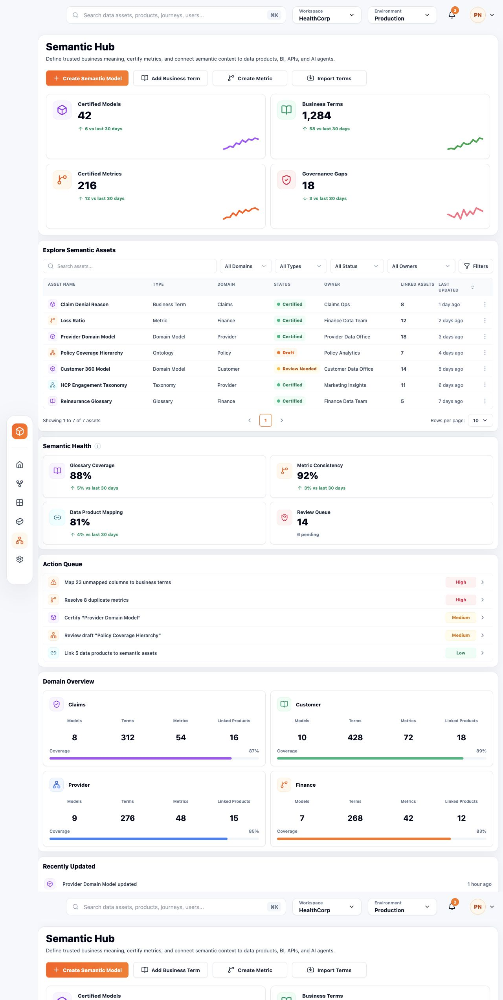
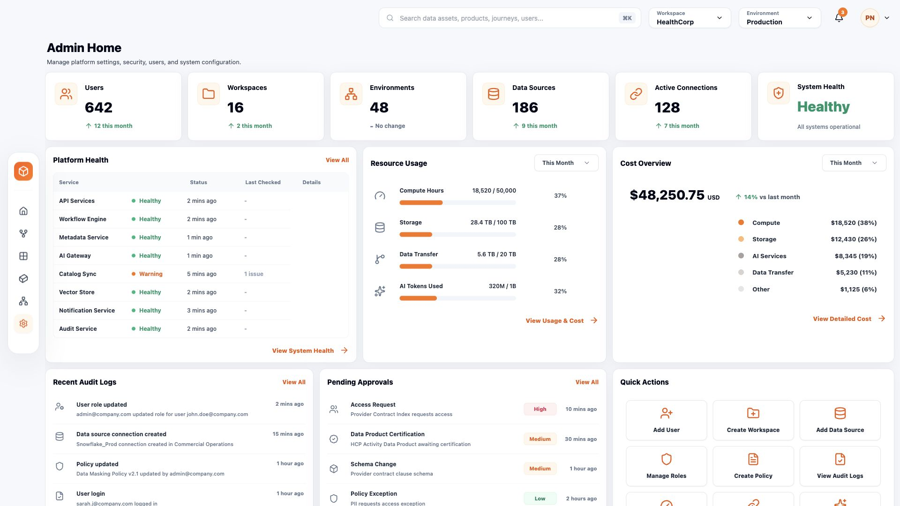

# Unified Data Platform

DataNexus is a front-end demo of an enterprise AI-for-data platform. It shows how data teams can connect cloud ecosystems, run governed data journeys, launch task-specific studios, publish trusted data products, manage business semantics, and operate the platform from one control surface.

The app is built as a demo-ready React experience. It uses local mock data, page state, drawers, search/filter interactions, and guided demo modals. There is no backend integration yet.

## Quick Start

```bash
npm install
npm run dev
```

Open the local Vite URL, usually:

```text
http://localhost:5173/
```

Build check:

```bash
npm run build
```

## What This Demo Shows

DataNexus is designed around a common enterprise problem: data teams have tools for ingestion, transformation, quality, catalogs, semantic models, BI, and AI, but the work is often fragmented. This demo presents a unified operating layer where those workflows are connected by journeys, products, semantics, governance, and platform telemetry.

Use it to tell this story:

1. Start from the Command Centre to see platform health, active work, recommendations, and data product reuse.
2. Open Data Journey to show how a business data initiative moves through source onboarding, processing, modeling, validation, publishing, semantic enablement, and consumption.
3. Use Studios to show guided workspaces and reusable templates for specialized work.
4. Use Data Products to show certified, reusable, governed data assets.
5. Use Semantic Hub to connect technical assets to business meaning, metrics, and domains.
6. Use Admin Home to show operational governance, auditability, cost, and platform control.

## Screens

### Command Centre

The Command Centre is the operator landing page. It gives a fast read on active journeys, product certification, open actions, platform health, reuse, cost, and connected ecosystem services.



What to notice:

- KPI tiles route users to the right operational surface.
- Business-goal cards help users start from intent, not tool selection.
- Pending actions and AI recommendations open related entity context.
- Cloud/provider logos reinforce the platform's cloud-agnostic positioning.

### Data Journey

Data Journey tracks end-to-end initiatives from ingestion to consumption. It combines portfolio metrics, journey inventory, pipeline stage state, artifacts, approvals, and execution details.



What to notice:

- Tabs separate structured, unstructured, hybrid, and personal work views.
- The selected journey shows a stage-by-stage pipeline canvas.
- Stage details expose execution target, artifacts, progress, logs, and approvals.
- This is the best screen for explaining the platform's delivery lifecycle.

### Studios

Studios are guided workspaces for common data platform jobs: ingestion, extraction, quality, productization, semantic modeling, and migration.



What to notice:

- Featured studios map to repeatable enterprise data work.
- Templates reduce blank-page starts for teams.
- Active sessions show progress, state, and ownership of running work.
- Recommendations connect studio activity back to products and semantics.

#### Processing & Extraction Studio

Processing & Extraction Studio is now implemented as a full create-pipeline workflow for document extraction, modality selection, processing flow design, validation, and publish readiness.



What to notice:

- The guided wizard covers Basics, Source & Modality, Processing Flow, and Review & Publish.
- Processing Flow supports both a visual canvas and generated pipeline code view.
- Validate Flow and Publish Pipeline open dedicated dialogs so the flow feels complete without a backend.
- This nested studio route is intentionally documented as a sub-capability to keep the README focused on primary product areas.

#### Ingestion Studio

Ingestion Studio is implemented as a dedicated guided workflow for designing, configuring, validating, scheduling, and publishing ingestion pipelines for cloud storage, databases, SaaS apps, APIs, file uploads, and streaming sources.

What to notice:

- The studio landing page includes functional entry points for creating a pipeline, browsing connectors, resuming drafts, importing configs, opening source-type starts, inspecting pipelines, viewing templates, and drilling into activity/health/connectors.
- The create pipeline wizard covers Pipeline Basics, Source & Connection, Mapping & Validation, Target & Schedule, and Review & Publish.
- Major wizard choices are stateful: domain, ingestion mode, source type, starter option, connector mode, connector, target zone, schedule, publish mode, stakeholder notification, and runbook creation update the flow and summary surfaces.
- Publish Pipeline opens a confirmation modal, Confirm & Publish opens the completion dialog, and the user can either stay in the review flow or return to the Ingestion Studio landing page.

### Data Products

Data Products is the governed catalog and product management surface. It presents certified assets, drafts, product quality, consumption options, health signals, and recommendations.



What to notice:

- Featured products show domain, owner, type, quality, freshness, and consumption methods.
- The catalog supports local search and filters for demo exploration.
- Governance tiles show contract compliance, SLA adherence, access requests, alerts, and certification queue.
- This is the main screen for explaining reusable data-as-a-product.

### Semantic Hub

Semantic Hub manages trusted business meaning across terms, metrics, semantic models, domains, and linked data products.



What to notice:

- Summary cards show semantic coverage and governance gaps.
- The asset table connects terms, metrics, models, ownership, and linked assets.
- Semantic Health and Action Queue show where stewardship work is needed.
- Domain Overview explains how business context is organized.

### Admin Home

Admin Home is the platform operations console for users, workspaces, connectors, environments, policies, health, usage, cost, audit logs, approvals, and quick actions.



What to notice:

- Platform health and usage make operations visible.
- Cost overview gives a quick FinOps story.
- Audit logs and approvals show governance accountability.
- Quick actions support common admin workflows.

## Demo Interactions

Most visible controls are wired so the app feels connected during a walkthrough:

- Primary actions open contextual demo modals.
- Rows, cards, pending actions, and recommendations open related entity drawers.
- Search and filters work locally on catalog-style screens.
- Ingestion Studio supports a multi-step create flow with editable fields, selectable cards, toggles, local summary updates, draft feedback, review details, and publish confirmation.
- Sidebar navigation switches between the six main routes.
- Top bar workspace, environment, notification, profile, and search controls expose demo flows or navigation.

## Routes

| Route | Screen | Purpose |
| --- | --- | --- |
| `/` | Command Centre | Platform overview and next best actions |
| `/data-journey` | Data Journey | Initiative lifecycle and delivery progress |
| `/studios` | Studios | Guided workspaces and templates |
| `/studios/ingestion` | Ingestion Studio | Ingestion pipeline dashboard, connectors, templates, and activity |
| `/studios/ingestion/create` | Create Ingestion Pipeline | Guided ingestion pipeline creation and publish flow |
| `/studios/processing-extraction` | Processing & Extraction Studio | Guided extraction pipeline creation |
| `/data-products` | Data Products | Governed product catalog |
| `/semantic-hub` | Semantic Hub | Business meaning, metrics, and semantic assets |
| `/admin` | Admin Home | Platform operations and governance |

## Tech Stack

- React 19
- TypeScript 6
- Vite 8
- React Router 7
- Tailwind CSS 3
- Lucide React icons
- Recharts

## Project Map

```text
src/
  App.tsx                     Route registration
  main.tsx                    React entry point
  pages/                      Main product screens
  components/common/          Drawers, modals, cards, buttons, tables
  components/layout/          Sidebar, top bar, app shell
  components/charts/          Lightweight chart visuals
  data/mockData.ts            Demo entities and relationships
  types/index.ts              Shared TypeScript types
icons/                        Cloud and ecosystem assets
docs/screenshots/             README screenshots
AI_HANDOFF.md                 Current product/context handoff
```

## Development Notes

- Keep the enterprise SaaS shell, sidebar, top bar, and dashboard language intact unless the product direction changes.
- Use `DemoFlowModal` for demo-only workflows that do not have backend behavior.
- Use `EntityDrawer` when a click should show related product, journey, semantic, studio, approval, or service context.
- Keep mock data in `src/data/mockData.ts` until API contracts are defined.
- Treat `AI_HANDOFF.md` as the latest context handoff for accepted UI direction and known preferences.

## Current Status

This is a polished front-end prototype, not a production platform. The next meaningful product steps are backend contracts, authentication/authorization, persistent entities, real connector telemetry, and replacing demo modals with working flows.
