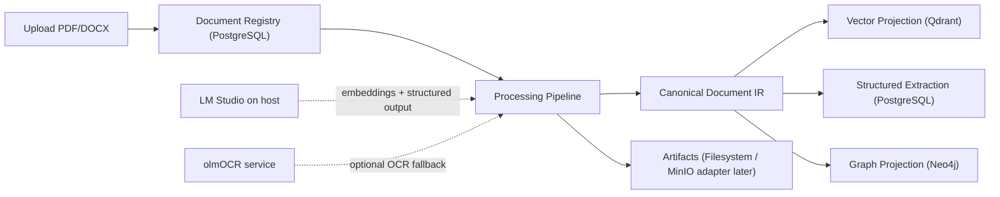

# Local Document Intelligence

Local Document Intelligence is a Mac-first application for processing PDF and DOCX files into reusable document intelligence assets. The full roadmap includes vector search assets, structured extraction records, and knowledge graph projections generated from one canonical document representation.

The current implementation covers Phase 0 through Phase 7: repository scaffold,
document upload and registry, processing trace records, Docling parsing into
canonical artifacts, layout-aware chunks, LM Studio embeddings, Qdrant vector
upsert, vector search, deterministic generic extraction, LM Studio structured
output extraction, persisted structured extraction records, exact-match entity
resolution, Neo4j graph projection, and feature-flagged OCR fallback through an
isolated olmOCR adapter. It also includes versioned domain extraction profiles,
a core ontology, evidence-bearing draft profile review, and typed output
materialization from generic extraction records.

## Architecture



## Prerequisites

- macOS, preferably Apple Silicon
- Python 3.11
- Homebrew
- Docker Desktop
- Git
- `uv`
- LM Studio for embeddings and optional model-enriched extraction

Install `uv` if needed:

```bash
brew install uv
```

## LM Studio

LM Studio runs on the host machine, outside Docker. Vector search calls the
OpenAI-compatible embeddings endpoint. Generic extraction can call the
OpenAI-compatible chat completions endpoint for Gemma structured output. Start
the LM Studio server on port `1234` and set:

```bash
LM_STUDIO_LLM_MODEL=<set-your-loaded-gemma-4-model-id>
LM_STUDIO_VLM_MODEL=<set-your-loaded-gemma-4-model-id>
LM_STUDIO_EMBEDDING_MODEL=<set-your-loaded-nomic-embedding-model-id>
```

## Configuration

Create local configuration from the example:

```bash
cp .env.example .env
```

Never commit `.env`. The default local service ports are:

| Service | Port |
|---|---:|
| FastAPI | 8000 |
| PostgreSQL | 5432 |
| Redis | 6379 |
| Qdrant REST | 6333 |
| Qdrant gRPC | 6334 |
| Neo4j Browser | 7474 |
| Neo4j Bolt | 7687 |
| MinIO API | 9000 |
| MinIO Console | 9001 |
| LM Studio | 1234 |

## Docker Compose

Start local persistence services:

```bash
make services-up
```

Stop them:

```bash
make services-down
```

Validate the compose file:

```bash
docker compose config
```

## Bootstrap

Run the full Phase 0 bootstrap:

```bash
make bootstrap
```

This verifies local prerequisites, creates `.env` only if missing, starts Docker Compose services, installs dependencies with `uv`, runs Alembic migrations, and prints next commands.

## API

Start FastAPI locally:

```bash
make api
```

Check liveness:

```bash
curl http://localhost:8000/health
```

Check readiness, including the configured database:

```bash
curl http://localhost:8000/ready
```

OpenAPI docs are available at:

```text
http://localhost:8000/docs
```

## Doc Test Lab UI

Install and start the local React test app:

```bash
make ui-install
make ui-dev
```

Open:

```text
http://localhost:5173
```

Doc Test Lab can upload PDF/DOCX files, trigger processing, browse document
assets, inspect vector matches, preview local graph context, view structured
extraction fields, and run a query workspace that combines available vector,
graph, and table projections. Structured extraction works deterministically
without a loaded model and is model-enriched when `LM_STUDIO_LLM_MODEL` is
configured. Neo4j projection is marked partial/retryable when Neo4j is not
running, while local graph nodes and edges remain visible from PostgreSQL.

## Worker

The worker executes an explicit Celery chain for parsing, vector projection,
structured extraction, graph projection, and quality finalization:

```bash
make worker
```

Processing is synchronous by default for the simplest local development loop.
To queue API processing through Redis and Celery, set:

```bash
PROCESSING_MODE=celery
```

The existing `POST /api/v1/documents/{document_id}/process` endpoint then
returns a processing run ID and Celery job ID immediately. The status endpoint
continues to expose persisted stage events.

## CLI

The CLI uses local services directly:

```bash
uv run docintel health
uv run docintel ingest ./samples/generated/contracts/vendor_services_agreement.pdf
uv run docintel process <document-id>
uv run docintel status <document-id>
uv run docintel artifacts <document-id>
uv run docintel extract <document-id>
uv run docintel rebuild-vectors <document-id>
uv run docintel vector-search "payment terms"
uv run docintel rebuild-graph <document-id>
uv run docintel graph-search "Acme"
uv run docintel profile-sync
uv run docintel profile-list
uv run docintel profile-show contract_v1
uv run docintel profile-materialize <document-id> contract_v1
```

## Domain Profiles

Phase 7 provides approved starter profiles for contracts, invoices, and policy
documents. Run migrations and synchronize them into PostgreSQL:

```bash
make migrate
uv run docintel profile-sync
```

Profiles define expected fields, entities, relationships, validation rules, and
typed output tables. Draft proposals require rationale and sample evidence.
Approval creates an approved but inactive version; activation is a separate
explicit operation, so proposals never mutate the active profile or ontology
automatically.

Useful API routes:

```text
POST /api/v1/extraction-profiles/sync-starters
GET  /api/v1/extraction-profiles
GET  /api/v1/extraction-profiles/{profile_key}
POST /api/v1/extraction-profiles/proposals
POST /api/v1/extraction-profiles/proposals/{proposal_id}/review
POST /api/v1/extraction-profiles/{profile_key}/versions/{version}/activate
GET  /api/v1/ontologies
POST /api/v1/documents/{document_id}/profiles/{profile_key}/materialize
GET  /api/v1/documents/{document_id}/typed-outputs
```

## Tests And Checks

```bash
make format
make lint
make typecheck
make test
make ui-build
```

Integration tests that require Docker services should use the `integration` marker. Live local model tests should use the `live_model` marker.

After starting services and applying migrations, run:

```bash
make test-integration
```

The integration suite checks PostgreSQL schema availability, Redis broker
connectivity, Qdrant upsert/search, and Neo4j graph projection. Individual
tests skip quickly when their local service is unavailable.

If the machine is offline and `uv run` attempts to resolve build dependencies,
use the existing virtual environment directly after `make install` has already
completed:

```bash
.venv/bin/ruff format .
.venv/bin/ruff check .
PYTHONPATH=src .venv/bin/mypy
PYTHONPATH=src .venv/bin/pytest
```

## Current Limitations

- Docling is the default parser for PDF and DOCX. Its local layout model artifacts may download on first use, then run locally.
- OCR fallback is feature-flagged through an isolated olmOCR HTTP adapter.
  With OCR disabled, low-text or scanned pages are marked retryable with page
  warnings and can be reprocessed after enabling `OCR_PROVIDER=olmocr` and
  `OLMOCR_ENABLED=true`.
- Vector search requires LM Studio embeddings and Qdrant to be running locally.
  If either service is unavailable, chunk artifacts remain persisted and vector
  projection runs are marked retryable.
- Generic extraction always runs deterministic local patterns first. Gemma 4
  structured-output enrichment requires LM Studio to be running with
  `LM_STUDIO_LLM_MODEL` configured; if unavailable or invalid, deterministic
  results are preserved and the extraction run is marked partial/retryable.
- Entity resolution currently uses exact normalized type/name matching. Aliases
  are persisted for exact matches. Candidate records now support later fuzzy,
  embedding, and LLM adjudication, but those matching strategies remain later
  enhancements.
- Neo4j is a serving projection. If Neo4j is unavailable,
  local graph nodes and edges remain available from the relational source and
  projection runs are marked partial/retryable.
- MinIO is available in Docker Compose, but the current phases use local filesystem directories only.
- olmOCR is optional and independently configured. It is not installed into this Python environment.
  When enabled, the app posts PDFs to `${OLMOCR_BASE_URL}/ocr` and accepts either
  canonical IR JSON or page-level OCR text/Markdown.
- Profile typed-output materialization currently maps matching generic scalar
  fields into one row per configured table. Repeated line-item extraction and
  profile-specific model prompts remain future enhancements.

## Roadmap

1. Phase 8: lightweight review UI.
2. Further hardening: repeated profile rows and richer entity resolution.

## Troubleshooting

- If `make bootstrap` cannot find `uv`, run `brew install uv`.
- If Docker commands fail, start Docker Desktop and wait until it reports ready.
- If `/ready` returns `503`, check that PostgreSQL is running and `DATABASE_URL` matches `.env`.
- For temporary local smoke testing when PostgreSQL is unavailable, the app can
  run against SQLite with `DATABASE_URL=sqlite+pysqlite:///data/dev.sqlite`.
  PostgreSQL remains the intended source of truth.
- If migrations fail, run `docker compose ps` and confirm the `postgres` service is healthy.
- If a later model-backed command fails, confirm LM Studio is running on `http://localhost:1234/v1` with the configured local model IDs.
- If scanned PDFs stay partial, confirm `OCR_PROVIDER=olmocr`, `OLMOCR_ENABLED=true`,
  and a separate olmOCR service is reachable at `OLMOCR_BASE_URL`.
