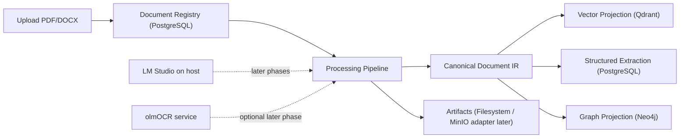

# Local Document Intelligence

Local Document Intelligence is a Mac-first application for processing PDF and DOCX files into reusable document intelligence assets. The full roadmap includes vector search assets, structured extraction records, and knowledge graph projections generated from one canonical document representation.

The current implementation covers Phase 0 through Phase 3: repository scaffold,
document upload and registry, processing trace records, Docling parsing into
canonical artifacts, layout-aware chunks, LM Studio embeddings, Qdrant vector
upsert, and vector search.

## Architecture



## Prerequisites

- macOS, preferably Apple Silicon
- Python 3.11
- Homebrew
- Docker Desktop
- Git
- `uv`
- LM Studio for later model-backed phases

Install `uv` if needed:

```bash
brew install uv
```

## LM Studio

LM Studio runs on the host machine, outside Docker. Phase 3 calls the
OpenAI-compatible embeddings endpoint. Start the LM Studio server on port `1234`
and set:

```bash
LM_STUDIO_LLM_MODEL=<set-your-loaded-gemma-4-model-id>
LM_STUDIO_VLM_MODEL=<set-your-loaded-gemma-4-model-id>
LM_STUDIO_EMBEDDING_MODEL=<set-your-loaded-nomic-embedding-model-id>
```

## Configuration

Create local configuration from the example:

```bash
cp .env.example .env
```

Never commit `.env`. The default local service ports are:

| Service | Port |
|---|---:|
| FastAPI | 8000 |
| PostgreSQL | 5432 |
| Redis | 6379 |
| Qdrant REST | 6333 |
| Qdrant gRPC | 6334 |
| Neo4j Browser | 7474 |
| Neo4j Bolt | 7687 |
| MinIO API | 9000 |
| MinIO Console | 9001 |
| LM Studio | 1234 |

## Docker Compose

Start local persistence services:

```bash
make services-up
```

Stop them:

```bash
make services-down
```

Validate the compose file:

```bash
docker compose config
```

## Bootstrap

Run the full Phase 0 bootstrap:

```bash
make bootstrap
```

This verifies local prerequisites, creates `.env` only if missing, starts Docker Compose services, installs dependencies with `uv`, runs Alembic migrations, and prints next commands.

## API

Start FastAPI locally:

```bash
make api
```

Check liveness:

```bash
curl http://localhost:8000/health
```

Check readiness, including the configured database:

```bash
curl http://localhost:8000/ready
```

OpenAPI docs are available at:

```text
http://localhost:8000/docs
```

## React Console

Install and start the local test console:

```bash
make ui-install
make ui-dev
```

Open:

```text
http://localhost:5173
```

The console can upload PDF/DOCX files, list registered documents, trigger
Docling processing, show generated artifact records, and run vector search when
LM Studio embeddings and Qdrant are available. Graph and structured extraction
panels still show explicit unavailable states until later phases are implemented.

## Worker

The worker entry point is scaffolded for later processing tasks:

```bash
make worker
```

The worker entry point is still scaffolded. Phase 1 and 2 processing currently
runs synchronously through the API or CLI so the local development loop stays
simple.

## CLI

The CLI uses local services directly:

```bash
uv run docintel health
uv run docintel ingest ./samples/generated/contracts/vendor_services_agreement.pdf
uv run docintel process <document-id>
uv run docintel status <document-id>
uv run docintel artifacts <document-id>
uv run docintel rebuild-vectors <document-id>
uv run docintel vector-search "payment terms"
```

Graph search and graph rebuild commands begin in later phases.

## Tests And Checks

```bash
make format
make lint
make typecheck
make test
```

Integration tests that require Docker services should use the `integration` marker. Live local model tests should use the `live_model` marker.

## Current Limitations

- Docling is the default parser for PDF and DOCX. Its local layout model artifacts may download on first use, then run locally.
- OCR fallback is not implemented yet. Low-text pages are marked with warnings.
- Vector search requires LM Studio embeddings and Qdrant to be running locally.
  If either service is unavailable, chunk artifacts remain persisted and vector
  projection runs are marked retryable.
- No generic extraction, entity resolution, or Neo4j graph projection yet.
- MinIO is available in Docker Compose, but the current phases use local filesystem directories only.
- olmOCR is optional and independently configured. It is not installed into this Python environment.

## Roadmap

1. Phase 4: generic structured extraction.
2. Phase 5: entity resolution and Neo4j projection.
3. Phase 6: OCR fallback through an isolated olmOCR adapter.
4. Phase 7: domain profiles and ontology drafts.
5. Phase 8: lightweight review UI.

## Troubleshooting

- If `make bootstrap` cannot find `uv`, run `brew install uv`.
- If Docker commands fail, start Docker Desktop and wait until it reports ready.
- If `/ready` returns `503`, check that PostgreSQL is running and `DATABASE_URL` matches `.env`.
- If migrations fail, run `docker compose ps` and confirm the `postgres` service is healthy.
- If a later model-backed command fails, confirm LM Studio is running on `http://localhost:1234/v1` with the configured local model IDs.
