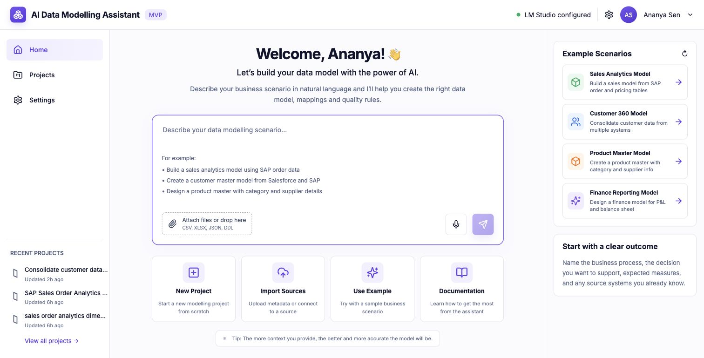
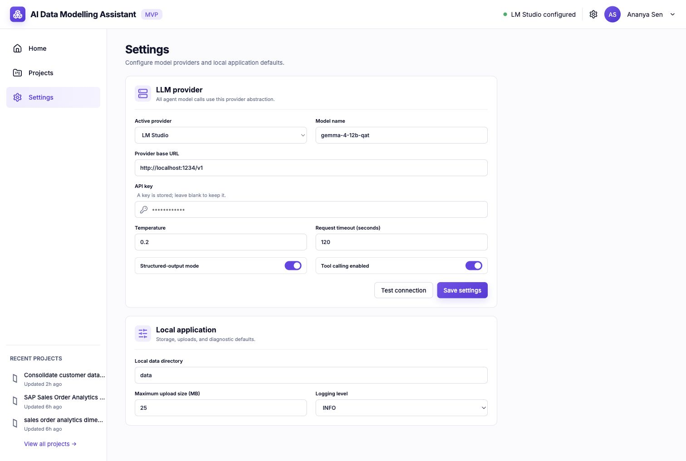
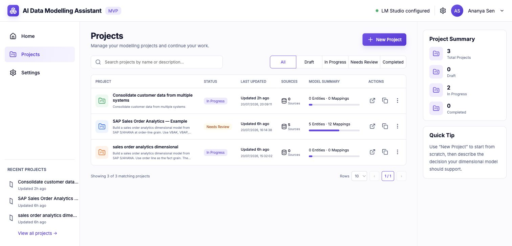
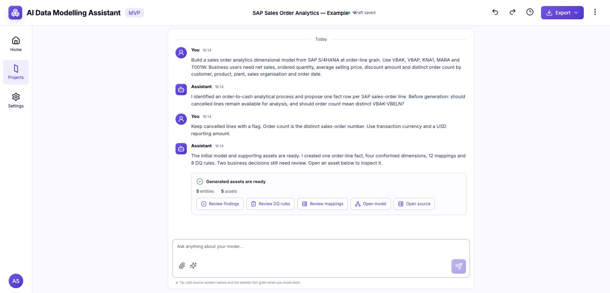
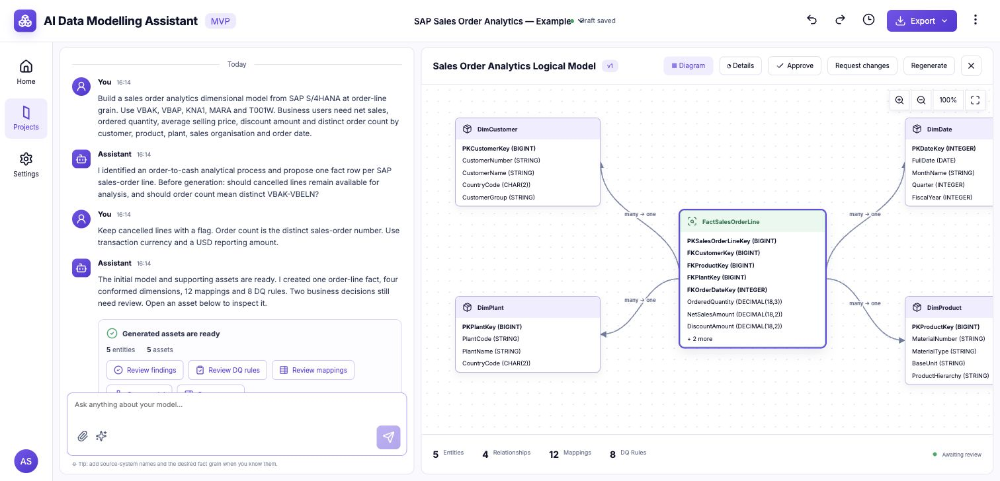
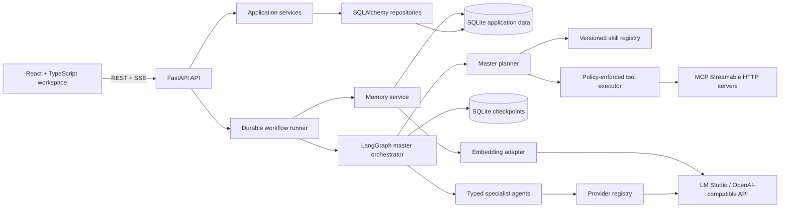
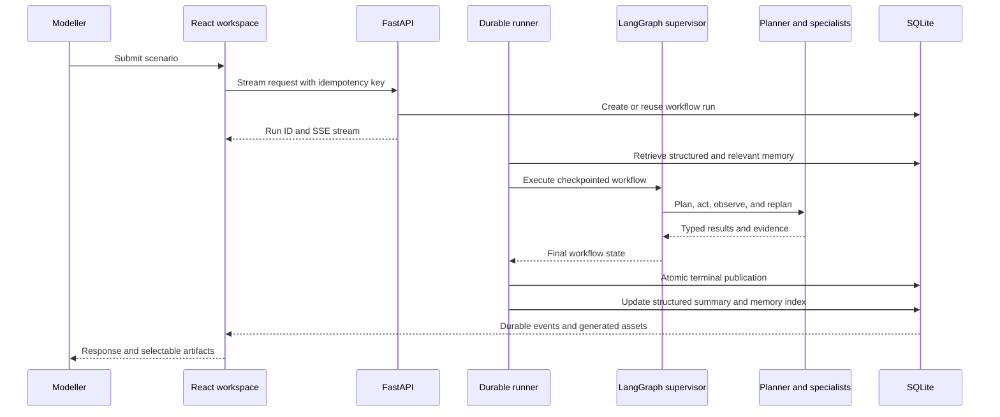
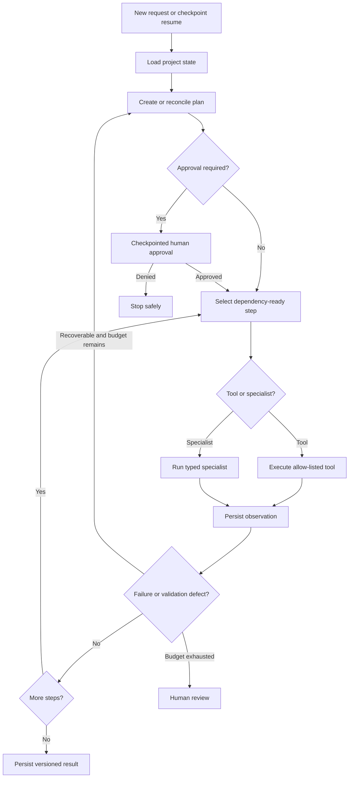
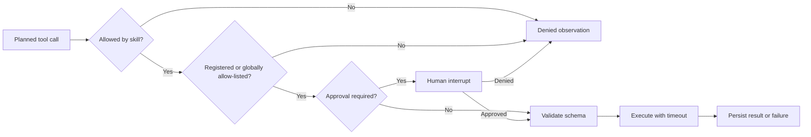

# AI Data Modelling Assistant

A local-first, chat-driven workspace that helps data modellers turn business requirements and source metadata into reviewable dimensional models, source-to-target mappings, data-quality rules, and validation findings.

The repository is an actively developed MVP foundation. Its primary path runs privately on local models through LM Studio, while the agent layer remains provider-independent.



## Contents

- [Implemented features](#implemented-features)
- [Installation and local hosting](#installation-and-local-hosting)
- [How a modeller uses the application](#how-a-modeller-uses-the-application)
- [Backend implementation](#backend-implementation)
- [Configuration](#configuration)
- [Testing and maintenance](#testing-and-maintenance)
- [Architecture](#architecture)
- [Agents, skills, tools, and MCP](#agents-skills-tools-and-mcp)
- [Conversation and modelling memory](#conversation-and-modelling-memory)
- [Providers and embeddings](#providers-and-embeddings)
- [Reliability and performance](#reliability-and-performance)
- [API overview](#api-overview)
- [Troubleshooting](#troubleshooting)
- [Roadmap](#roadmap)

## Implemented features

- Create, reopen, search, duplicate, and delete modelling projects.
- Upload and profile CSV, JSON, DDL/SQL, XLSX, and XLSM sources.
- Run a master planner with typed requirement, source-analysis, model-design, mapping/DQ, and validation specialists.
- Stream progress and responses over reconnectable SSE.
- Generate versioned source previews, logical models, mappings, DQ rules, and validation assets.
- Review, revise, regenerate, and browse artifact history.
- Use allow-listed local tools and approval-gated MCP tools.
- Resume durable runs and prevent duplicate requests, tool operations, messages, and artifact versions.
- Use deterministic fast paths for clear source metadata and structural validation, with LLM escalation when semantics are ambiguous.
- Keep recent conversation context and durable LangGraph checkpoints for active work.
- Automatically maintain structured project memory for confirmed grain, decisions, assumptions, terminology, and preferences.
- Rank older project memories with `nomic-embed-text`, with lexical fallback when the embedding provider is unavailable.
- Optionally share selected summaries and preferences across projects, with explicit Settings controls and deletion.

The logical-model canvas remains closed and empty until a generated asset is selected. The generated artifact—not a hardcoded preview—is rendered when the modeller opens it.

### Capability status

| Capability | Status | Notes |
| --- | --- | --- |
| Projects and persistent conversations | Implemented | Create, reopen, search, duplicate, and delete |
| Source upload and profiling | Implemented | CSV, JSON, DDL/SQL, XLSX, XLSM |
| Dimensional model generation | Implemented | One central fact for the MVP |
| Mappings and starter DQ rules | Implemented | Evidence, confidence, and review state included |
| Independent validation | Implemented | Deterministic structural checks plus LLM escalation |
| Artifact review and versions | Implemented | Approve, request changes, edit JSON, browse history |
| Targeted regeneration | Implemented | Starts at the affected specialist and reruns dependencies |
| Built-in tools | Implemented | Source-profile summary and workflow context |
| MCP integration | Implemented foundation | Requires an external allow-listed MCP server |
| Project memory | Implemented | Automatic structured summary plus older request, response, and artifact context |
| Cross-project memory | Implemented, opt-in | Disabled by default; inspectable and deletable through API and Settings |
| Embeddings and retrieval | Implemented | Local SQLite vector storage, cosine ranking, lexical failure fallback |
| Export formats | Planned | Export UI exists; downloads are not complete |
| Anthropic Claude | Placeholder | Provider contract exists; transport is deferred |
| A2A endpoint | Planned | Internal contracts are ready for later exposure |

### Agent ecosystem at a glance

#### Agents

| Agent | What it does | Status |
| --- | --- | --- |
| Master planner | Builds the bounded plan, selects skills and tools, and controls approval and replanning | Implemented |
| Requirement agent | Extracts the objective, KPIs, source context, candidate grain, and blocking questions | Implemented |
| Source-analysis agent | Interprets profiled metadata, source roles, keys, and relationship evidence | Implemented |
| Model-design agent | Designs the dimensional fact, dimensions, attributes, keys, and relationships | Implemented |
| Mapping and DQ agent | Generates source-to-target mappings and starter data-quality rules | Implemented |
| Validation agent | Critiques structural integrity, mapping coverage, and DQ coverage | Implemented |

#### Skills

| Skill | Owner | Overview |
| --- | --- | --- |
| `requirements.clarification` | Requirement agent | Clarify requirements and select a defensible grain |
| `sources.evidence-analysis` | Source-analysis agent | Analyse uploaded and profiled source evidence |
| `sources.external-metadata` | Source-analysis agent | Discover metadata through approved MCP tools |
| `models.dimensional-design` | Model-design agent | Design the dimensional logical model |
| `governance.mapping-dq` | Mapping and DQ agent | Create mappings, DQ rules, and review items |
| `governance.model-validation` | Validation agent | Validate artifacts and trigger bounded rework |

#### Tools and MCP

| Capability | Type | Overview | Availability |
| --- | --- | --- | --- |
| `source.profile_summary` | Built-in tool | Reads persisted source-profile summaries | Available |
| `project.workflow_context` | Built-in tool | Reads the current typed workflow context | Available |
| `mcp.<server>.<tool>` | External MCP tool | Calls an explicitly configured Streamable HTTP MCP server | Configuration required |
| MCP schema discovery | MCP support | Resolves advertised schemas before execution | Implemented |
| MCP approval interrupt | MCP safety | Pauses the checkpointed plan for modeller approval | Implemented |

No external MCP tools are bundled or enabled by default. Their actual list comes from `MCP_SERVERS_JSON` and `MCP_TOOL_ALLOWLIST`. See [Agents, skills, tools, and MCP](#agents-skills-tools-and-mcp) for the detailed execution and policy model.

## Stack

| Layer | Technology |
| --- | --- |
| Frontend | React 18, strict TypeScript, Vite, TanStack Query |
| API | Python 3.12, FastAPI, Pydantic |
| Agents | LangGraph, typed specialists, bounded reactive planning |
| Persistence | SQLite, SQLAlchemy, Alembic |
| Local AI | LM Studio OpenAI-compatible chat and embedding APIs |
| Quality | Pytest, Ruff, mypy, Vitest, ESLint, TypeScript |

## Prerequisites

- Python 3.12 or newer
- [uv](https://docs.astral.sh/uv/getting-started/installation/)
- Node.js 20.19 or newer (or 22.12 or newer) with npm
- LM Studio with its local API server enabled

Load these models in LM Studio:

- Chat: `gemma-4-12b-qat`
- Embeddings: `nomic-embed-text`
- Base URL: `http://localhost:1234/v1`

The interface and project CRUD run without LM Studio. Model generation and provider health checks require the chat model to be loaded.

## Installation and local hosting

### Quick start

From the repository root:

```bash
make setup
make dev
```

`make setup` creates `.env` when needed, installs locked Python and frontend dependencies, creates the data directory, and applies every Alembic migration. `make dev` starts both services with live reload. Press `Ctrl+C` once to stop them.

Open:

- App: [http://127.0.0.1:5173](http://127.0.0.1:5173)
- API docs: [http://127.0.0.1:8000/docs](http://127.0.0.1:8000/docs)
- Health: [http://127.0.0.1:8000/api/health](http://127.0.0.1:8000/api/health)
- Readiness: [http://127.0.0.1:8000/api/ready](http://127.0.0.1:8000/api/ready)

### Background hosting

```bash
make start
make status
make stop
```

Logs and PID files are stored in the ignored `.run/` directory. `make start` applies pending migrations before launching. Ports are strict, so Vite fails clearly instead of silently moving to another port.

### Separate terminals

```bash
make backend
```

In a second terminal:

```bash
make frontend
```

### Manual installation

```bash
cp .env.example .env

cd backend
uv sync --extra dev --frozen
uv run alembic upgrade head

cd ../frontend
npm ci
```

## How a modeller uses the application

### 1. Configure and test LM Studio

Open **Settings** and confirm the provider, model, base URL, structured-output mode, and tool-calling preference. Use **Test connection** before a modelling run.



Application-saved provider settings take precedence for runtime chat calls. API keys stay backend-only and are never returned to the browser.

### 2. Describe the modelling outcome

On Home, describe the analytical decision, business process, measures, likely fact grain, and known sources. Attach metadata when available.

Example:

> Build a sales-order analytics dimensional model from SAP S/4HANA at one row per sales-order line. Use VBAK, VBAP, KNA1, MARA, and T001W. Users need net sales, ordered quantity, discount amount, average selling price, and distinct order count by customer, product, plant, sales organisation, and order date. Keep cancelled lines with a flag. Generate the logical model, mappings, and core DQ rules.

For a ready-made walkthrough:

```bash
make seed-example
```

Open **SAP Sales Order Analytics — Example**.

### 3. Manage and reopen work

Projects shows status, recency, source count, entity count, and mapping count. Search, filter, open, or duplicate a project.



### 4. Work through the conversation

The assistant may ask blocking questions when grain, KPI meaning, source availability, or a material design choice is unclear. Follow the streamed plan, specialist progress, tool activity, and approval requests.

Generated-asset actions appear only after assets exist. The canvas stays closed until **Open model**, **Review mappings**, **Review DQ rules**, **Review findings**, or **Open source** is selected.



### 5. Review the generated assets

The logical-model viewer displays the persisted model and renders relationship arrows from actual relationship records. A modeller can:

- inspect facts, dimensions, keys, attributes, measures, and grain;
- zoom, fit, and drag entities while persisting canvas positions;
- switch between diagram and details;
- review mappings, confidence, transformations, and evidence;
- review starter DQ rules and validation findings;
- approve or request changes; and
- regenerate the affected asset and dependent outputs.



### 6. Reopen and continue

Messages, source profiles, generated artifacts, review decisions, project state, workflow runs, and checkpoints persist. Return to Projects and reopen the model to continue.

Clear profiled metadata can be analysed locally. Unknown source roles, open design decisions, low-confidence mappings, and explicit review items escalate to the configured chat model.

## Backend implementation

The backend is layered so HTTP routes stay thin and agents do not depend on storage or provider SDKs.

| Layer | Responsibility |
| --- | --- |
| `app/api` | FastAPI validation, response schemas, SSE endpoints |
| `app/services` | Projects, conversations, artifacts, ingestion, providers, workflow execution |
| `app/repositories` | SQLAlchemy persistence boundaries |
| `app/db` | ORM models, sessions, SQLite configuration |
| `app/orchestration` | LangGraph state, nodes, dispatch, supervision, replanning |
| `app/agents` | Typed specialists, versioned prompts, safe fallbacks |
| `app/autonomy` | Planner, capability manifests, tools, MCP, execution contracts |
| `app/llm` | Provider and embedding abstractions and adapters |
| `app/runtime.py` | Shared HTTP client, checkpointer, locks, tasks, provider guard |

### Persisted records

- Projects and latest typed workflow state
- User and assistant messages linked to workflow runs
- Uploaded source metadata and lightweight profiles
- Immutable generated-artifact versions and reviews
- Workflow runs and ordered SSE events
- Idempotent tool operations and cached specialist results
- Structured project summaries, embedding-backed memory entries, and opt-in user memory
- LangGraph node checkpoints in a separate SQLite database

SQLite runs with foreign keys, WAL mode, a busy timeout, and normal synchronous mode. Project state, artifacts, assistant response, terminal event, run status, and lease release are published in one transaction.

### Source ingestion

- CSV and JSON records are sampled.
- SQL DDL is parsed into table and column metadata.
- XLSX and XLSM workbooks are opened read-only.
- Profiles include columns, inferred primitive types, null counts, small sample values, and evidence.
- Full binary files and complete datasets are not placed into agent prompts.

## Configuration

Configuration lives in the ignored root `.env`. Safe defaults are documented in [`.env.example`](./.env.example).

| Variable | Default | Purpose |
| --- | --- | --- |
| `DATABASE_URL` | `sqlite:///./data/assistant.db` | Database relative to `backend/` |
| `APP_HOST` / `APP_PORT` | `127.0.0.1` / `8000` | Backend bind address |
| `FRONTEND_HOST` / `FRONTEND_PORT` | `127.0.0.1` / `5173` | Frontend bind address |
| `VITE_API_URL` | `http://127.0.0.1:8000/api` | Browser-visible API URL |
| `LM_STUDIO_BASE_URL` | `http://localhost:1234/v1` | LM Studio API |
| `LM_STUDIO_MODEL` | `gemma-4-12b-qat` | Chat model |
| `EMBEDDING_MODEL` | `nomic-embed-text` | Embedding model |
| `MEMORY_ENABLED` | `true` | Enable automatic project-memory update and retrieval |
| `MEMORY_RETRIEVAL_LIMIT` | `5` | Maximum relevant older memories injected per run |
| `MEMORY_EMBEDDING_TIMEOUT` | `10` | Embedding timeout before lexical fallback |
| `WORKFLOW_CHECKPOINT_PATH` | `./data/workflow_checkpoints.db` | LangGraph checkpoints |
| `MCP_SERVERS_JSON` | `{}` | Named MCP Streamable HTTP servers |
| `MCP_TOOL_ALLOWLIST` | empty | Fully qualified allowed MCP tools |

Provider settings saved in the Settings screen take precedence for runtime chat requests. API keys remain backend-only and are never returned to the frontend.

### Performance and resilience

- `PLANNER_FAST_PATH` and `PRESENTER_FAST_PATH` remove two LLM calls from standard workflows.
- `DETERMINISTIC_SOURCE_ANALYSIS` handles unambiguous profiled sources locally.
- `DETERMINISTIC_STRUCTURAL_VALIDATION` performs typed referential checks locally.
- `AGENT_RESULT_CACHE_ENABLED` enables provider/model/prompt/input-aware caching.
- `LLM_MAX_CONCURRENCY` bounds simultaneous provider calls.
- Circuit-breaker, timeout, SSE polling, context-size, and cache TTL settings are in `.env.example`.

Set either deterministic option to `false` to force the corresponding specialist through the LLM.

### MCP tools

MCP is disabled until a server and an allow-listed tool are configured:

```dotenv
MCP_SERVERS_JSON={"catalog":"http://127.0.0.1:9000/mcp"}
MCP_TOOL_ALLOWLIST=mcp.catalog.list_tables,mcp.catalog.describe_table
```

MCP plans require modeller approval. Schemas are validated before execution, calls are budgeted, and failed observations can trigger bounded replanning. Configure only trusted servers.

## Trusted LAN hosting

The default binds to localhost. For a trusted LAN, replace `192.168.1.20` with the host address in `.env`:

```dotenv
APP_HOST=0.0.0.0
FRONTEND_HOST=0.0.0.0
FRONTEND_ORIGIN=http://192.168.1.20:5173
VITE_API_URL=http://192.168.1.20:8000/api
```

Then run `make start`. This is a local development deployment without TLS, authentication, or production process supervision. Do not expose it directly to the public internet.

## Database and generated files

```bash
make migrate       # apply Alembic migrations
make seed-example  # create or refresh the showcase project
make clean         # remove caches, logs, PIDs, and frontend build output
```

Application state is stored under ignored `backend/data/`. `make clean` does not delete databases, uploads, `.env`, installed dependencies, or virtual environments. To reset data, first back it up, stop the app, and manually remove `backend/data/`.

Terminal workflow publication is transactional: project state, artifact versions, assistant message, terminal event, status, and lease release become visible together. Progress events remain independently durable for SSE reconnection.

## Testing and maintenance

```bash
make test
make lint
```

`make test` runs backend and frontend tests. `make lint` runs Ruff, strict mypy, ESLint, TypeScript, and a production frontend build.

Individual commands:

```bash
cd backend
uv run python -m pytest
uv run ruff check .
uv run mypy app

cd ../frontend
npm test -- --run
npm run lint
npm run build
npm audit
```

Verified baseline:

- 29 backend tests passing
- Frontend component tests passing
- Ruff and strict mypy passing
- ESLint and TypeScript passing
- Production Vite build passing
- npm audit reporting zero vulnerabilities

Maintenance commands:

```bash
make migrate       # apply migrations
make seed-example  # create or refresh the showcase project
make clean         # remove caches, logs, PIDs, and build output
```

## Architecture



### Request lifecycle



## Agents, skills, tools, and MCP

The agent framework is LangGraph. The master orchestrator owns routing and shared state; specialists do not call each other directly and contain no provider-specific SDK logic.

### Autonomous reactive planning



The execution plan is authoritative and contains dependency-aware steps, completion criteria, iteration and tool-call budgets, selected skills and tools, and approval requirements. The supervisor validates every selection against the capability registry before execution.

### Implemented agents

| Agent | Responsibility | Typed output | Modes |
| --- | --- | --- | --- |
| Master planner | Selects steps, skills, tools, budgets, and approval policy | `ExecutionPlan` | Deterministic, LLM, fallback, cache |
| Requirement and clarification | Extracts objective, process, KPIs, sources, outputs, grain, and blocking questions | `ModellingBrief` | LLM, fallback, cache |
| Source analysis | Interprets profiles without inventing statistics; identifies roles, keys, and relationships | `SourceAnalysis` | Deterministic, LLM, fallback, cache |
| Model design | Creates fact, dimensions, attributes, keys, measures, grain, and relationships | `LogicalModelProposal` | LLM, fallback, cache |
| Mapping and DQ | Creates mappings, transformations, confidence, review items, and starter rules | `MappingDQProposal` | LLM, fallback, cache |
| Critic and validation | Checks structural integrity, targets, mapping coverage, and DQ coverage | `ValidationReport` | Deterministic, LLM, fallback, cache |

Every specialist result includes agent ID and version, confidence, evidence, assumptions, execution mode, and fallback reason when applicable. Outputs are Pydantic-validated. Transient transport failures receive a bounded retry; persistent failures use conservative, explicitly labelled fallbacks.

### Implemented skills

A runtime skill is a versioned JSON capability manifest owned by an agent. It declares capabilities, allowed tools, and approval policy; it is not unrestricted executable code.

| Skill ID | Owner | Capabilities | Allowed tools | Approval |
| --- | --- | --- | --- | --- |
| `requirements.clarification` | Requirement agent | Requirements, clarification, grain selection | None | No |
| `sources.evidence-analysis` | Source-analysis agent | Source analysis, profiling, key identification | `source.profile_summary` | No |
| `sources.external-metadata` | Source-analysis agent | External metadata and MCP access | `mcp.*`, constrained globally | Always |
| `models.dimensional-design` | Model-design agent | Dimensional, entity, relationship design | `project.workflow_context` | No |
| `governance.mapping-dq` | Mapping/DQ agent | Mapping, DQ, review triage | `project.workflow_context` | No |
| `governance.model-validation` | Validation agent | Critique, validation, reactive replanning | `project.workflow_context` | No |

Skill manifests live in `backend/app/autonomy/skills/`. Unknown and duplicate IDs are rejected.

### Implemented built-in tools

| Tool | Purpose | Boundary |
| --- | --- | --- |
| `source.profile_summary` | Returns persisted source profiles, sampled-row counts, columns, and column counts | Current workflow source-profile state only |
| `project.workflow_context` | Returns available typed artifacts and the current workflow stage | Current project workflow state only |

The tool executor validates the selected skill's allow-list and the tool input schema, applies timeouts, records status and duration, and reports failures back to the supervisor as observations. Stable fingerprints allow completed tool results to be reused after checkpoint recovery.

### MCP implementation

MCP uses the official Python SDK with Streamable HTTP:

1. Servers are explicitly named in `MCP_SERVERS_JSON`.
2. Fully qualified tools must be present in `MCP_TOOL_ALLOWLIST`.
3. The external-metadata skill always requires modeller approval.
4. LangGraph interrupts before execution and resumes only after approval.
5. The MCP server's advertised input schema is resolved and validated.
6. `isError` responses become failed observations.
7. Tool schemas use a bounded TTL cache.
8. Calls use timeouts and durable operation fingerprints.

```dotenv
MCP_SERVERS_JSON={"catalog":"http://127.0.0.1:9000/mcp"}
MCP_TOOL_ALLOWLIST=mcp.catalog.list_tables,mcp.catalog.describe_table
```

No external MCP server is bundled, so MCP is disabled by default. The implementation does not provide unrestricted tool discovery, arbitrary shell execution, remote skill installation, or a full MCP ecosystem.



## Conversation and modelling memory

The assistant uses several distinct memory layers. Current user instructions always take priority over retrieved memory when they conflict.

| Layer | Scope | What is stored | How it is used |
| --- | --- | --- | --- |
| Working conversation | Current run | A bounded window of recent user and assistant messages | Supplied to the planner and specialists without allowing prompts to grow indefinitely |
| Workflow checkpoints | Project/run | LangGraph execution state, plan progress, observations, and interrupts | Resumes incomplete or approval-gated work safely |
| Structured project memory | Project | Objective, process, confirmed grain, KPIs, sources, decisions, assumptions, terminology, and preferences | Automatically refreshed after every successfully completed run and injected as durable modelling context |
| Semantic memory | Project | Older requests, assistant responses, and generated summaries with embeddings | Retrieves the most relevant older context for a new request instead of replaying the full history |
| User memory | Cross-project | Project summaries and manually saved facts, terminology, or preferences | Used only when **Cross-project memory** is explicitly enabled in Settings |

Project memory is on by default and stays within its project. Cross-project memory is off by default. The Settings screen can enable or disable its use and permanently delete all cross-project entries. Project-scoped memory can be inspected or deleted with the project memory API.

Embeddings are generated through the provider-neutral interface using LM Studio and `nomic-embed-text`. Vectors are stored locally in SQLite and ranked with cosine similarity. If LM Studio or the embedding model is unavailable, the workflow continues and uses lexical relevance; memory enhancement never makes the modelling run fail.

This is application memory, not model fine-tuning. Deleting memory does not delete the separately persisted project conversation, artifacts, or LangGraph checkpoints.

## Providers and embeddings

Agents depend only on the internal provider interface.

| Provider | Status | Notes |
| --- | --- | --- |
| LM Studio | Implemented and primary | OpenAI-compatible structured output and streaming |
| OpenAI | Implemented through compatible transport | Requires model and API key |
| Custom OpenAI-compatible | Implemented | Configurable URL, model, and key |
| Anthropic Claude | Placeholder | Contract and Settings option exist; transport is deferred |

The provider-neutral embedding boundary is used by the memory service. The LM Studio adapter checks available models, resolves `nomic-embed-text`, calls `/embeddings`, and restores input order. The current local index stores vectors as SQLite JSON and performs bounded in-process cosine ranking. This is appropriate for the MVP's project-sized memory; a dedicated vector index and source-evidence RAG remain future scale work.

## Reliability and performance

- Workflow execution is independent of the browser SSE connection.
- Every request has a durable run ID and ordered events.
- Refreshing or disconnecting does not terminate backend work.
- The client reconnects after the last received sequence.
- Startup recovery resumes queued or running work from LangGraph checkpoints.
- Client idempotency keys prevent duplicate submissions.
- Database and in-process project locks prevent conflicting runs.
- Tool fingerprints prevent repeated completed operations.
- Terminal state, artifact versions, response, event, status, and lease release commit atomically.
- One pooled HTTP client, concurrency semaphore, and circuit breaker protect providers.
- Specialist results are cached by agent version, provider, model, prompt, input, and schema.
- Deterministic planner, presenter, source-analysis, and validation fast paths reduce LLM calls.

## API overview

Interactive OpenAPI documentation is available at `/docs`.

| Area | Implemented endpoints |
| --- | --- |
| Health | Health and readiness |
| Projects | List, create, read, patch, duplicate, delete |
| Conversations | List messages, start/reconnect/cancel SSE runs, inspect active run |
| Sources | List and upload project sources |
| Artifacts | List/get, review, revise, save canvas layout |
| Settings | Read/save provider settings and test provider |
| Memory | Inspect/delete project memory; enable/disable and list/delete cross-project memory |
| Autonomy | List skills/tools, test MCP server, inspect project execution state |

See [`docs/architecture.md`](./docs/architecture.md) and the product specification [`CODEX_AI_Data_Modelling_Assistant_MVP.md`](./CODEX_AI_Data_Modelling_Assistant_MVP.md).

## Repository layout

```text
backend/
  alembic/             database migrations
  app/api/             thin FastAPI routes
  app/agents/          typed specialists and prompts
  app/autonomy/        planning, skills, tools, and MCP
  app/orchestration/   LangGraph state and master graph
  app/repositories/    persistence boundaries
  app/services/        application workflows
  tests/               backend tests
frontend/
  src/components/      reusable UI components
  src/features/        Home, Projects, Workspace, Settings
  src/services/        typed API and SSE client
scripts/               setup and local process helpers
docs/
  images/              current application screenshots
  architecture.md      implementation architecture notes
```

Current screenshots live under `docs/images/`. Local `.env`, application databases, uploaded data, logs, PID files, caches, virtual environments, `node_modules`, and generated builds are ignored by Git.

## Troubleshooting

### LM Studio health check fails

- Confirm the LM Studio server is running on port `1234`.
- Load `gemma-4-12b-qat` and verify its identifier in Settings.
- Test `http://localhost:1234/v1/models` locally.

### Frontend cannot reach the API

- Check `make status` or the terminal running `make dev`.
- Open `/api/ready` on port `8000`.
- Confirm `VITE_API_URL` and `FRONTEND_ORIGIN` are browser-reachable.
- Restart the frontend after changing `.env`.

### Frontend is blank after installing dependencies

A Vite server started before `npm ci` or a dependency upgrade may still reference replaced client files. Stop that process and restart the frontend:

```bash
make stop
make dev
```

If it was started in a separate terminal, use `Ctrl+C` in that terminal first.

### A port is already in use

Run `make stop`, or change `APP_PORT`, `FRONTEND_PORT`, and `VITE_API_URL` consistently.

### Dependencies or migrations are stale

Run `make setup` again. Installation is lockfile-based and safe to repeat.

## Roadmap

### Planned next

- Richer deterministic profiling: distinct percentages, numeric statistics, candidate-key scores
- Relationship scoring using normalized names, uniqueness, overlap, and data-type compatibility
- Natural-language operation extraction and deterministic model mutations
- Impact analysis and approval for material changes
- Fine-grained model diff, operation history, undo, and redo
- JSON, mapping CSV, DQ CSV, Mermaid, Markdown, and optional SQL DDL exports
- Completed Anthropic Claude transport
- Remote A2A-style validation-agent endpoint and agent card
- Scalable vector index and source-evidence search for large catalog collections
- Trusted live database/catalog integrations through additional tools and MCP servers

### Outside the current MVP

- Data Vault and operational normalized modelling
- Enterprise MDM and survivorship
- Direct SAP connectivity and production database writeback
- Multi-tenancy, enterprise RBAC, and simultaneous collaboration
- Automated pipeline generation
- Production deployment automation
- Full enterprise lineage extraction
