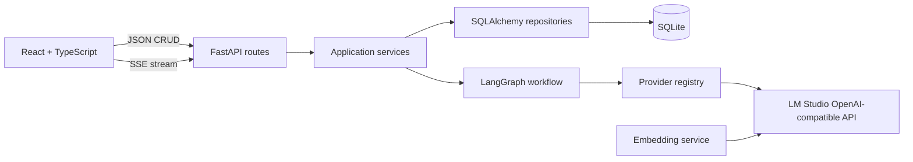

# Foundation architecture

Routes validate and translate HTTP concerns only. Services own use-case sequencing, repositories isolate SQLAlchemy, and agents/workflows receive an `LLMProvider` rather than constructing provider clients. The embedding boundary uses the same OpenAI-compatible LM Studio server but is independent of chat generation.

The current graph has three stable scaffolding nodes: load project state, understand the scenario, and present a response. The second node is deliberately mocked; its state shape is ready for the future requirement agent without coupling the initial streaming path to provider-specific code.

Project and message state is authoritative in SQLite. Browser state is used only for transient composer and streaming presentation state.

