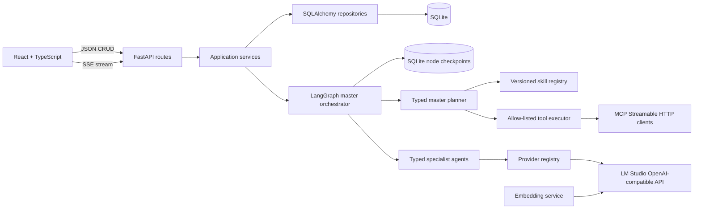

# Foundation architecture

Routes validate and translate HTTP concerns only. Services own use-case sequencing, repositories isolate SQLAlchemy, and agents/workflows receive an `LLMProvider` rather than constructing provider clients. The embedding boundary uses the same OpenAI-compatible LM Studio server but is independent of chat generation.

The master graph owns planning, routing and shared state. The planner selects only registered skills and tools and sets finite iteration and tool budgets. Tool results are observations supplied to downstream specialists. Its specialist nodes are requirement clarification, source analysis, logical model design, mapping and DQ generation, and validation. Blocking requirements or missing sources stop safely for human input. The reactive supervisor observes validation and routes only the affected step while budget remains.

Every skill is a versioned JSON manifest containing its owning agent, capabilities, tool permissions and approval policy. The tool executor independently checks the plan against that manifest, so prompt output alone cannot grant a capability. Built-in and MCP calls share the same execution-record contract.

MCP uses short-lived Streamable HTTP sessions. Server URLs and fully-qualified tools are configured separately, and a wildcard is permitted only inside the dedicated external-metadata skill. Any MCP step forces a LangGraph interrupt and cannot execute until the modeller approves the checkpointed plan.

Each specialist has a versioned system prompt, typed Pydantic contract, declared identity, and provider-independent `LLMProvider` dependency. Structured responses are schema-validated and receive one JSON-repair attempt. If LM Studio times out or still returns invalid output, an evidence-labelled deterministic fallback keeps the local workflow usable without pretending that invented analysis came from the model.

Project, message, source profile, artifact, review, and latest workflow state are authoritative in SQLite. A separate SQLite LangGraph checkpointer saves every node transition under the project ID. Browser state is used only for transient composer, canvas interaction, and streaming presentation state.

Generated assets are also authoritative SQLite records. A workspace fetches the project's artifact list but does not select one automatically. The chat displays an asset summary only when records exist, and the relevant viewer is mounted only after the modeller explicitly opens an asset.

Source uploads are inspected before agent execution. CSV and JSON records are sampled, DDL is parsed, and modern Excel workbooks are opened read-only. Profiles record columns, inferred primitive types, null counts, small sample values, and evidence; agents never receive the entire binary file.

Artifact versions are immutable when edited: an edit creates the next type-specific version. Review state and canvas layout can be updated independently. Regeneration starts at the selected specialist and reruns only agents whose outputs depend on that artifact.

## Orchestration event contract

The streaming route mirrors `agent.started` and `agent.completed` events to the client with the specialist ID, confidence, and execution mode (`llm` or `fallback`). After `workflow.completed`, it streams a concise presenter response, persists the new workflow state and versioned assets, then emits `done`. Provider transport failures emit `error` and mark the project workflow as failed.
