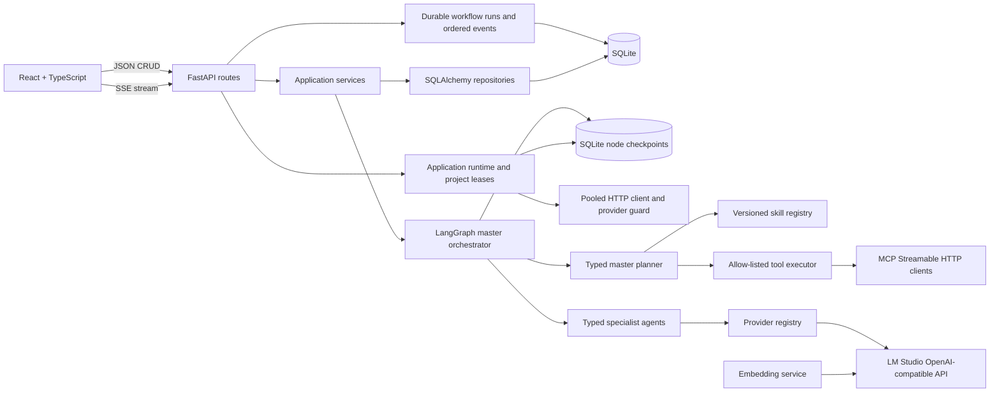

# Foundation architecture

Routes validate and translate HTTP concerns only. Services own use-case sequencing, repositories isolate SQLAlchemy, and agents/workflows receive an `LLMProvider` rather than constructing provider clients. The embedding boundary uses the same OpenAI-compatible LM Studio server but is independent of chat generation.

The master graph owns planning, routing and shared state. The planner selects only registered skills and tools and sets finite iteration and tool budgets. The plan dispatcher treats that plan as authoritative: it selects only dependency-ready steps, executes their declared tools first, and then routes to the owning specialist. A shortened or regenerated plan therefore skips unaffected agents rather than falling through a fixed pipeline. Tool results and failures are persisted observations. Recoverable failures and validation defects return to the planner while budget remains; exhaustion stops safely for review.

Every skill is a versioned JSON manifest containing its owning agent, capabilities, tool permissions and approval policy. The orchestrator derives approval from the manifest as well as the plan, so prompt output cannot bypass policy. The tool executor independently checks every request against the selected skill. Built-in and MCP calls share the same execution-record contract.

MCP uses short-lived Streamable HTTP sessions. Server URLs and fully-qualified tools are configured separately, and a wildcard is permitted only inside the dedicated external-metadata skill. Any MCP step forces a LangGraph interrupt and cannot execute until the modeller approves the checkpointed plan. Before invocation, the advertised MCP input schema is resolved and arguments are validated. MCP `isError` responses become failed observations rather than successful tool records.

Each specialist has a versioned system prompt, typed Pydantic contract, declared identity, and provider-independent `LLMProvider` dependency. Structured responses are schema-validated and receive one JSON-repair attempt. Transient transport failures receive one bounded retry; persistent provider or validation failures use an evidence-labelled deterministic fallback without pretending that invented analysis came from the model.

Project, message, source profile, artifact, review, and latest workflow state are authoritative in SQLite. A separate SQLite LangGraph checkpointer saves every node transition under the project ID. Browser state is used only for transient composer, canvas interaction, and streaming presentation state.

Workflow runs and their ordered SSE events are durable SQLite records. The HTTP stream follows those events but does not own graph execution, so disconnecting or refreshing the browser does not terminate a run. A project-level database lease prevents conflicting work across processes; an in-process lock queues requests for the same project. Client idempotency keys deduplicate submission retries. Startup recovery clears orphaned leases and resumes queued or running work from LangGraph checkpoints.

Application lifespan owns the pooled HTTP client, provider concurrency guard, circuit state, and async LangGraph checkpointer. Standard full-model requests use a deterministic validated plan and presenter; requests requiring external capabilities, regeneration, or recovery retain LLM planning. Agent inputs use bounded recent history and source excerpts. Successful specialist results are cached only when provider, model, prompt version, payload, and output schema all match.

Generated assets are also authoritative SQLite records. A workspace fetches the project's artifact list but does not select one automatically. The chat displays an asset summary only when records exist, and the relevant viewer is mounted only after the modeller explicitly opens an asset.

Source uploads are inspected before agent execution. CSV and JSON records are sampled, DDL is parsed, and modern Excel workbooks are opened read-only. Profiles record columns, inferred primitive types, null counts, small sample values, and evidence; agents never receive the entire binary file.

Artifact versions are immutable when edited: an edit creates the next type-specific version. Review state and canvas layout can be updated independently. Regeneration starts at the selected specialist and reruns only agents whose outputs depend on that artifact.

## Orchestration event contract

The streaming route mirrors `agent.started` and `agent.completed` events to the client with the specialist ID, confidence, and execution mode (`llm` or `fallback`). After `workflow.completed`, it streams a concise presenter response, persists the new workflow state and versioned assets, then emits `done`. Provider transport failures emit `error` and mark the project workflow as failed.
