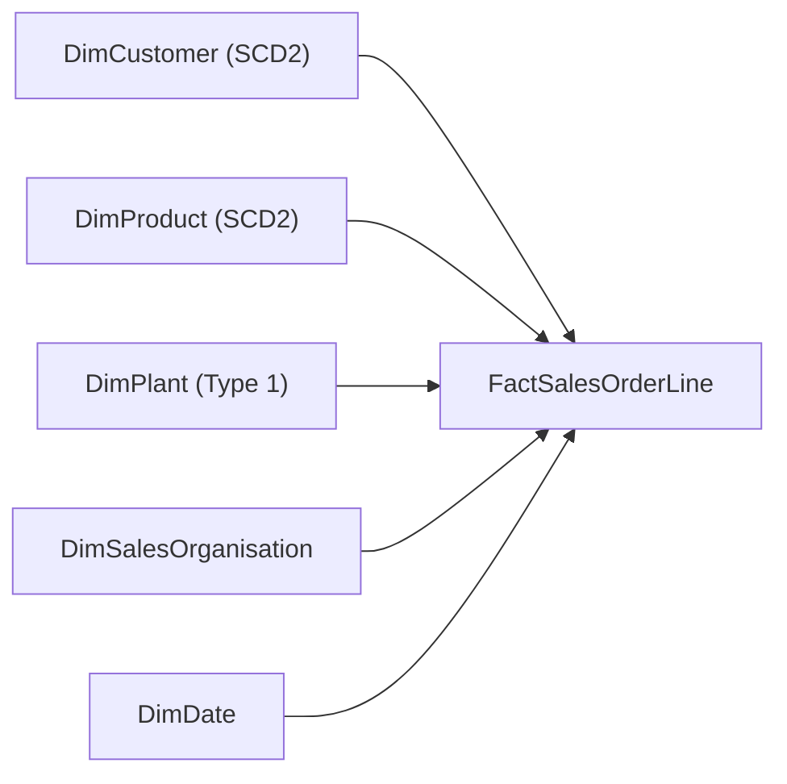

# Example implementation: SAP sales-order analytics

This walkthrough demonstrates how a data modeller collaborates with the AI Data Modelling Assistant from an incomplete business request through clarification, source analysis, model generation, governed change, validation, and project reopening.

The scenario is intentionally incomplete at the beginning so the clarification workflow can be tested. Exact model details can vary with the configured chat model, but the interaction stages and persisted asset types should remain consistent.

## Business scenario

A sales analytics team needs a dimensional model for SAP S/4HANA sales orders. Analysts want to understand revenue and order quantities across customers, products, plants, sales organisations, and dates.

Known source objects:

| Object | Role | Important fields |
| --- | --- | --- |
| `VBAK` | Sales-order header | `VBELN`, order date, sales organisation, customer |
| `VBAP` | Sales-order line | `VBELN`, `POSNR`, product, plant, quantity, net amount |
| `KNA1` | Customer master | Customer identifier, name, country, region |
| `MARA` | Material master | Material identifier, description, category |
| `T001W` | Plant reference | Plant identifier, name, country |

Expected analytical measures include net sales, ordered quantity, discount amount, average selling price, and distinct order count.

## Before starting

1. Start LM Studio and load `gemma-4-12b-qat` and `nomic-embed-text`.
2. Start the application with `make start`.
3. Open `http://127.0.0.1:5173`.
4. In **Settings**, test the LM Studio connection.
5. Optionally run `make seed-example` if you also want the pre-generated showcase project.

## Guided user interaction

### Step 1: submit an intentionally incomplete request

From Home, enter:

> Build a sales analytics model from SAP tables VBAK, VBAP, KNA1, MARA, and T001W. Users need to analyse sales and quantity by customer, product, plant, sales organisation, and date. Generate the logical model, mappings, and data-quality rules.

What the system does:

- creates and persists a project;
- has the master planner select the requirements workflow;
- extracts the business objective, source objects, requested outputs, and KPIs;
- identifies missing modelling decisions before generating assets;
- shows up to two typed clarification questions at a time.

No model canvas should appear at this point because no logical-model asset exists yet.

### Step 2: answer the clarification rounds

Use the clarification card to provide these answers when the corresponding questions appear:

| Clarification | Suggested answer |
| --- | --- |
| Fact grain | `One row per sales order line` |
| Business/source keys | `VBAK is keyed by VBELN; VBAP by VBELN + POSNR; master tables use their SAP identifiers.` |
| Source relationships | `Join VBAK to VBAP on VBELN; customer and material identifiers connect order lines to KNA1 and MARA; plant connects to T001W.` |
| History | `Track Customer and Product history using SCD Type 2; keep Plant as current state.` |
| KPI definitions | `Net sales is the sum of line net amount; ordered quantity is the sum of line quantity; distinct order count counts VBELN; average selling price is net sales divided by quantity.` |

What the system does:

- attaches every answer to a typed requirement category;
- merges it with the existing modelling brief rather than starting over;
- measures coverage for objective, grain, keys, relationships, history, and KPIs;
- reruns the requirements agent until blocking gaps are resolved;
- persists the conversation and structured brief between rounds.

### Step 3: provide source metadata

Upload CSV headers, SQL DDL, JSON metadata, or a spreadsheet describing the SAP objects. If representative metadata is unavailable, the assistant can continue conservatively from named sources, but mappings should be treated as needing review.

What the system does with uploaded metadata:

- profiles columns, types, null percentages, distinctness, value ranges, and candidate-key strength;
- preserves declared PK/FK references from DDL;
- classifies transaction, header, master-data, and reference sources;
- identifies business-key candidates;
- scores relationships using names, keys, roles, data types, and sampled-value overlap;
- infers cardinality and foreign-key nullability;
- recommends Type 1 or Type 2 handling for master data using temporal-column evidence.

### Step 4: review generated assets

After the run completes, the assistant should offer persisted assets such as:

| Asset | What the modeller reviews |
| --- | --- |
| Source analysis | Roles, columns, candidate keys, relationships, confidence, and evidence |
| Logical model | Fact grain, dimensions, attributes, keys, measures, and relationship arrows |
| Mappings | Source-to-target rules, transformation type, confidence, and review reasons |
| DQ rules | Key completeness, uniqueness, referential integrity, amount validity, and date checks |
| Validation | Structural defects, coverage gaps, severity, evidence, and recommended action |

A representative model shape is:

Select **Open model** to display the canvas. Relationship arrows must come from persisted relationship records rather than a hardcoded preview.

### Step 5: request a controlled model change

Enter:

> Change the grain to invoice line.

The system should:

1. Parse the request as a typed `change_grain` operation.
2. Analyse affected entities, mappings, DQ rules, relationships, and validation assets.
3. Display proposed changes and risks in the impact card.
4. Pause at a checkpointed approval step because the change is structural.
5. Apply the mutation only after **Approve plan** is selected.
6. Regenerate the affected downstream artifacts and validate them.
7. Save new artifact versions and add the operation to project history.

Other supported example commands are:

> Make Customer SCD Type 2.

> Split Geography into a dimension.

An invalid target such as `Make Supplier SCD Type 2` should be rejected during impact analysis rather than failing during mutation.

### Step 6: observe validation and repair

If validation reports a repairable model or mapping defect, the reactive supervisor should:

- select the affected specialist;
- create a bounded repair plan;
- rerun only that specialist and its downstream dependencies;
- stop when validation passes or the iteration budget is exhausted;
- preserve the reasoning in the decision trace.

Unresolved or high-risk findings remain visible for human review.

### Step 7: close and reopen the project

Return to **Projects**, reopen the project, and verify that the following remain available:

- full user and assistant conversation;
- structured requirements and confirmed grain;
- latest workflow and approval state;
- source profiles and analysed evidence;
- generated artifact versions and review state;
- logical-model layout;
- project memory and relevant older context.

Project memory is automatic. Cross-project memory remains disabled unless explicitly enabled in **Settings → Memory**.

## Expected logical design

The final design should normally contain one central line-level fact and conformed dimensions. Exact naming can differ, but a defensible proposal should include:

- `FactSalesOrderLine` at one row per sales-order line, or the subsequently approved grain;
- customer, product, plant, sales-organisation, and date dimensions;
- surrogate dimensional keys and a documented source/business key strategy;
- measures with definitions that respect the confirmed grain;
- source-supported many-to-one relationships;
- SCD metadata when history is requested;
- mappings and DQ rules connected to actual model attributes.

## Acceptance checklist

- [ ] Missing requirements are clarified before initial asset generation.
- [ ] The canvas stays closed until a generated asset is selected.
- [ ] Source relationships include confidence, cardinality, nullability, and evidence.
- [ ] Model relationship arrows render on the canvas.
- [ ] Mappings and DQ rules are generated and reviewable.
- [ ] A structural natural-language change shows impact before execution.
- [ ] Rejecting approval leaves the model unchanged.
- [ ] Approving creates revised downstream artifacts.
- [ ] Validation performs bounded targeted repair where appropriate.
- [ ] The project can be reopened with conversation, artifacts, and memory intact.

## Quick demo prompt

For a faster run that supplies most decisions in one message, use:

> Build an SAP S/4HANA sales-order analytics dimensional model at one row per sales-order line using VBAK, VBAP, KNA1, MARA, and T001W. Join VBAK to VBAP on VBELN and use VBELN + POSNR as the line business key. Track Customer and Product history with SCD Type 2 and keep Plant current-state only. Define net sales as the sum of line net amount, ordered quantity as the sum of line quantity, distinct order count as distinct VBELN, and average selling price as net sales divided by quantity. Generate the source analysis, logical model, mappings, core DQ rules, and validation findings.
